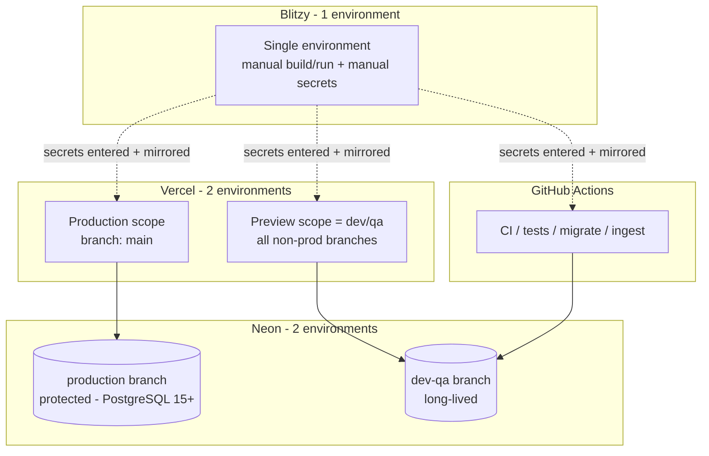

# Technical Specification

# 0. Agent Action Plan

## 0.1 Intent Clarification

This section restates the user's request in precise technical terms and surfaces the implicit requirements that the Blitzy platform inferred from the codebase. The subject project is **`compvault`** (a Star Wars Card Price Tracker) whose delivery backlog lives entirely as markdown tickets under `tickets/` — six epics, eighteen features, and fifty-five stories totalling 5,893 lines [tickets/]. The request concerns how those tickets describe the *environment strategy* across three platforms (Blitzy, Neon, and Vercel) and asks that the documented strategy be reconciled with the user's real-world constraints.

### 0.1.1 Core Objective

Based on the provided requirements, the Blitzy platform understands that the objective is to **revise the planning backlog so that its environment strategy matches the user's actual platform footprint — one Blitzy environment (manually provisioned), and exactly two environments each in Neon and Vercel (dev/qa and production) — and to produce the human-executable copy-paste build steps, manual secrets list, and platform setup instructions that this revised strategy requires.**

The verbatim request decomposes into the following discrete, clarified requirements:

- **Requirement R-1 — Collapse Blitzy from three environments to one.** The backlog's first epic specifies building three Blitzy environments named exactly Dev, Staging, and Prod [tickets/EPIC-01/FEATURE-01-01/STORY-01-01-01-create-blitzy-environments.md:§Acceptance Criteria]. The user has one Blitzy environment and is keeping one. All "three environments / Dev-Staging-Prod" language must collapse to a single environment.
- **Requirement R-2 — Replace programmatic provisioning with manual copy-paste build steps.** Because Blitzy cannot create environments, the ticket model that assumes a dashboard-driven "create an environment per target" flow [tickets/EPIC-01/FEATURE-01-01/STORY-01-01-01-create-blitzy-environments.md:L12] must be reframed as manual instructions the user pastes into the single existing environment.
- **Requirement R-3 — Produce the explicit list of secrets/variables to add manually.** The user must hand-enter the variable set rather than have it provisioned automatically. The canonical set is defined across the secrets stories [tickets/EPIC-01/FEATURE-01-01/STORY-01-01-02-define-secrets-and-variables.md, tickets/EPIC-01/FEATURE-01-03/STORY-01-03-01-author-env-example.md].
- **Requirement R-4 — Ripple the adjustments through the remaining epics.** The environment-strategy language is repeated across EPIC-02 through EPIC-06 in boilerplate "Environment Access & Configuration" sections and "Platforms and access required" tables [tickets/EPIC-02-database-platform-and-schema.md, tickets/EPIC-06-testing-and-cicd-quality-gates.md]; these must be brought into line.
- **Requirement R-5 — Reduce Neon to two environments (dev/qa + production) with human setup instructions.** The backlog provisions a four-role Neon topology (production, per-PR preview, per-CI ephemeral, local dev) [tickets/EPIC-02/FEATURE-02-01-neon-project-and-branching-topology.md]; this must collapse to two long-lived environments and ship with human setup instructions.
- **Requirement R-6 — Reduce Vercel to two environments (dev/qa + production) with human setup instructions.** Vercel must be framed as exactly two environments and accompanied by human setup instructions.

**Implicit requirements detected** (not stated verbatim but necessary for a correct result):

- The copy-paste build/run steps must be **faithful to the actual code**, not generic. The application is a Next.js App Router project; the build installs dependencies and runs the Next.js build, and the run step starts the Next.js server [tickets/EPIC-01/FEATURE-01-01/STORY-01-01-01-create-blitzy-environments.md:L13].
- The **Node runtime floor must be reconciled.** The tickets cite Node `>=18` (sourced from the Apify package) [tickets/EPIC-01/FEATURE-01-01/STORY-01-01-01-create-blitzy-environments.md:L14], but the root application manifest pins `engines.node` to `>=20.20.2` [package.json:engines.node]. The copy-paste steps must use the highest explicitly documented floor (Node 20).
- **Secret hygiene must be preserved.** Secrets are entered as encrypted values, real values are never committed, and `.env` files are already git-ignored [.gitignore]. Deferred integrations (eBay) and Phase-3 integrations (Stripe) remain placeholders [tickets/EPIC-01/FEATURE-01-03/STORY-01-03-01-author-env-example.md].
- **Connection discipline must survive the collapse.** The pooled (`DATABASE_URL`) vs unpooled (`DATABASE_URL_UNPOOLED`) split for runtime vs migrations, and the PostgreSQL 15+ floor required by the `valuation` table constraint, must be retained [tickets/EPIC-02/FEATURE-02-01/STORY-02-01-04-document-pooled-and-unpooled-connections.md, tickets/EPIC-02/FEATURE-02-01/STORY-02-01-01-provision-neon-project-and-production-branch.md].
- An **architectural trade-off must be acknowledged:** folding per-PR and per-CI throwaway Neon branches into one shared dev/qa branch removes per-run database isolation (concurrent CI runs and PRs share dev/qa state). This is an inherent consequence of the two-environment directive.

**Dependencies and prerequisites:** Requirement R-2/R-3 (Blitzy steps and secrets) depend on R-5/R-6 (the Neon and Vercel connection strings populate `DATABASE_URL`/`DATABASE_URL_UNPOOLED` and the Vercel scope variables). The ripple in R-4 depends on the canonical decisions taken for R-1, R-5, and R-6 so that every downstream restatement is consistent.

### 0.1.2 Task Categorization

- **Primary task type:** Documentation + Configuration — the work edits planning/specification markdown in `tickets/` and authors human setup instructions. No application source code is written or executed.
- **Secondary aspects:** Build/Deploy — the deliverable includes provisioning guidance (copy-paste build/run steps and Neon/Vercel setup) that governs how the system is built and deployed.
- **Scope classification:** Cross-cutting change — the environment strategy is restated across the entire `tickets/` backlog (all six epics), and the change is fundamentally an **infrastructure-documentation** change rather than a feature change.

### 0.1.3 Special Instructions and Constraints

The user's request is preserved verbatim below as the authoritative source of intent:

> **User Request (verbatim):** "epic 1 in tickets/ folder shows building 3 environments in blitzy. We only have 1 environment in blitzy and keeping only 1 environment. Blitzy cannot create environments so you have to give me the copy and paste build steps you want me to add based on the code and secrets variables i need to add manually. these adjustments may trickle down to the rest of the epics so adjust those as well. we also only want to create only 2 environments (dev/qa and production environments) in neon and vercel, so will need human setup instructions for those as well"

Directives extracted from the request:

- **"We only have 1 environment in blitzy and keeping only 1 environment"** — hard constraint: the target Blitzy environment count is exactly one.
- **"Blitzy cannot create environments so you have to give me the copy and paste build steps"** — methodological constraint: provisioning is manual; the deliverable must be copy-paste-ready human instructions, not automation.
- **"based on the code and secrets variables i need to add manually"** — the steps and the secrets list must be derived from the actual repository code, and the secrets are entered by the user by hand.
- **"these adjustments may trickle down to the rest of the epics so adjust those as well"** — explicit instruction to ripple the change across every epic, not just EPIC-01.
- **"only 2 environments (dev/qa and production environments) in neon and vercel"** — hard constraint: exactly two environments each in Neon and Vercel, named/framed as dev/qa and production.
- **"will need human setup instructions for those as well"** — the deliverable must include human setup instructions for both Neon and Vercel.

**Web search requirements:** Research was required to validate the two-environment patterns for Neon (database branching as environments) and Vercel (environment variable scopes) so that the human setup instructions reflect each vendor's documented, supported approach. The findings are summarized in section 0.2.

### 0.1.4 Technical Interpretation

These requirements translate to the following technical implementation strategy. Each clarified requirement maps to concrete actions using the form *"To [achieve goal], we will [create/modify] [components] by [approach]"*:

- **To collapse Blitzy to one environment (R-1),** we will *modify* the EPIC-01 provisioning cluster (`EPIC-01-environment-and-configuration-foundation.md`, `FEATURE-01-01-*` and its three stories, `FEATURE-01-02-*`, `FEATURE-01-03-*`) by rewriting every "three / Dev / Staging / Prod" reference — titles, user stories, acceptance criteria, sub-tasks, edge cases, and definitions of done — to describe a single environment (e.g., acceptance criterion "environment count stays at three" becomes "environment count stays at one"; isolation-between-three edge cases are removed).
- **To replace programmatic provisioning with manual steps (R-2) and enumerate the manual secrets (R-3),** we will *create* a consolidated human guide (`docs/ENVIRONMENT-SETUP.md`) by deriving copy-paste build/run commands from the Next.js App Router target [tickets/EPIC-01/FEATURE-01-01/STORY-01-01-01-create-blitzy-environments.md:L13] and the root manifest [package.json:engines.node], and by listing the eight-variable secret set the user must hand-enter.
- **To reduce Neon to two environments (R-5),** we will *modify* `FEATURE-02-01-neon-project-and-branching-topology.md` and its four stories by retaining the production branch and one long-lived dev/qa branch, and repurposing the per-PR preview and per-CI ephemeral stories so that previews, CI, and local development all target the shared dev/qa branch.
- **To reduce Vercel to two environments (R-6),** we will *modify* the Vercel-facing stories (`STORY-01-03-02`, `FEATURE-05-01`, `STORY-05-01-01`, `STORY-04-01-01`) by framing the Production scope as "production" and the Preview scope as "dev/qa" (which applies to all non-production branches), pointing the Preview scope at the Neon dev/qa branch.
- **To ripple the change (R-4),** we will *modify* the boilerplate "Environment Access & Configuration" sections and "Platforms and access required" tables across the EPIC-02–EPIC-06 mains and the environment-access features/stories so that every restatement of the environment model is consistent with the decisions above.


## 0.2 Repository Scope Discovery

This section documents the exhaustive repository search that identified every file affected by the environment-strategy change, the external research conducted to validate the two-environment patterns, and the assessment of the existing infrastructure and conventions that the edits must preserve.

### 0.2.1 Comprehensive File Analysis

The repository was confirmed to contain no `.blitzyignore` files, so no ignore patterns constrain the analysis. The affected surface is the `tickets/` backlog plus a small set of authoritative grounding files. A full enumeration of `tickets/` returns **79 markdown files: 6 EPIC mains, 18 FEATURE files, and 55 STORY files (5,893 lines total)** [tickets/].

A targeted search for environment-strategy terminology produced the following distribution, which drives the edit tiers:

- **"Staging" / Dev-Staging-Prod (the Blitzy three-environment naming)** appears in 13 files, including all six EPIC mains and the entire EPIC-01 provisioning cluster [tickets/EPIC-01/FEATURE-01-01-blitzy-environment-provisioning.md].
- **Neon branching terms** ("preview branch", "per-PR", "per-CI", "ephemeral") cluster in EPIC-02/FEATURE-02-01 and ripple into EPIC-04/05/06 environment-access files [tickets/EPIC-02/FEATURE-02-01-neon-project-and-branching-topology.md].
- **"docs.blitzy.com"** (the canonical Blitzy environments provisioning reference) appears in roughly 60 files — relevant because the user states Blitzy cannot create environments, so this reference must be reframed as informational.
- **The "Environment Access & Configuration" boilerplate section** appears in roughly 42 files (every EPIC main, most features, and every environment-access story).
- **"Vercel"** appears in roughly 30 files; the Production/Preview/Development scope language must be framed as exactly two environments.

The affected files are organized into three edit tiers:

- **Tier 1 — Primary (deep edits that define the strategy):**
  - *Blitzy three-to-one:* `EPIC-01-environment-and-configuration-foundation.md`; `FEATURE-01-01-blitzy-environment-provisioning.md` + `STORY-01-01-01/02/03`; `FEATURE-01-02-application-scaffolding-and-tooling.md` + `STORY-01-02-01`; `FEATURE-01-03-secrets-and-variable-management.md`.
  - *Neon four-to-two:* `EPIC-02-database-platform-and-schema.md`; `FEATURE-02-01-neon-project-and-branching-topology.md` + `STORY-02-01-01/02/03/04` (the per-PR and per-CI stories are the largest rewrites); `FEATURE-02-02/STORY-02-02-03-create-migration-rehearsal-workflow.md`; `FEATURE-02-03/STORY-02-03-01-implement-pooled-neon-client.md`.
  - *Vercel two-environment framing:* `FEATURE-01-03/STORY-01-03-02-configure-vercel-env-vars.md`; `EPIC-05/FEATURE-05-01-frontend-foundation-and-environment-access.md` + `STORY-05-01-01-configure-vercel-preview-and-env-access.md`; `EPIC-04/FEATURE-04-01/STORY-04-01-01-configure-vercel-runtime-and-env-access.md`.
- **Tier 2 — Ripple (boilerplate sections and "Platforms and access required" tables):** the `EPIC-02`, `EPIC-03`, `EPIC-04`, `EPIC-05`, and `EPIC-06` mains; environment-access features/stories `FEATURE-04-01`, `FEATURE-05-01`, `FEATURE-06-01`, `STORY-06-01-01-configure-vitest-and-env-access.md`, `STORY-06-01-03-wire-integration-tests-to-neon-branch.md`, `STORY-06-02-02-author-integration-tests-api-routes.md`; and the EPIC-03 ingestion files `FEATURE-03-01`, `STORY-03-01-01-configure-apify-access-and-token.md`, `FEATURE-03-03`, `STORY-03-03-01-create-scheduled-ingestion-workflow.md`.
- **Tier 3 — Incidental (light touch):** assorted EPIC-03/04/05 stories that carry a single passing "preview"/"branch" reference — edited only where they restate the legacy count or branch model.

In addition, a single new file is proposed for **creation**: `docs/ENVIRONMENT-SETUP.md`, a consolidated human setup guide that holds the copy-paste Blitzy build/run steps, the manual secrets list, and the Neon and Vercel two-environment setup instructions — directly satisfying the user's request for copy-paste steps, a secrets list, and human setup instructions.

### 0.2.2 Web Search Research Conducted

Research validated that the user's two-environment targets align with each vendor's documented, supported patterns:

- **Neon — database branches as environments.** Neon's recommended model is to give production and development their own independent root branches, with the development branch derived from a production snapshot/clone (Neon: "Promoting Postgres Changes Safely From Multiple Environments to Production"). For smaller teams, a single, relatively long-lived development branch is an explicitly endorsed alternative to per-PR/per-developer branches (Neon: "Practical Guide to Database Branching"). This directly supports collapsing the four-role topology into one long-lived dev/qa branch plus production.
- **Neon — protected production and credential isolation.** Production should be marked a protected branch to prevent accidental deletes/resets; child branches of a protected production branch receive isolated credentials (Neon: "Practical Guide to Database Branching").
- **Neon — pooled vs unpooled connections.** Neon ships a built-in PgBouncer-based pooler exposed via a separate pooled connection string, which is required for serverless platforms such as Vercel to avoid exhausting Postgres connections; the direct/unpooled string is used for migrations (Neon branching documentation). This confirms retaining the `DATABASE_URL` / `DATABASE_URL_UNPOOLED` split.
- **Vercel — environment variable scopes.** Vercel exposes three scopes: Production, Preview, and Development. Preview-scoped variables apply to any non-production git branch (Vercel: "Environment variables"). The faithful mapping for "dev/qa + production" therefore uses the built-in Production scope for production and the Preview scope for dev/qa, while the Development scope is local-only (consumed via `vercel env pull`) rather than a third deployed environment.
- **Vercel — sensitive variables.** Sensitive (encrypted, non-readable) environment variables can only be created in the Preview and Production scopes (Vercel: "Sensitive environment variables"), which matches the tickets' requirement to mark database and API secrets as Sensitive.

**Conclusion:** the user's "two environments (dev/qa and production) in Neon and Vercel" is the standard, documented pattern. Neon becomes production (protected) plus one long-lived dev/qa branch; Vercel becomes the Production scope plus the Preview scope (dev/qa) pointing at the Neon dev/qa branch; both retain the pooled/unpooled discipline and Sensitive flagging.

### 0.2.3 Existing Infrastructure Assessment

- **Project structure and state.** The repository is a pre-implementation backlog: `README.md`, `package.json`, and `.gitignore` at the root; an `apify/` actor for data ingestion; `docs/` (the PRD and `schema.sql`); and the `tickets/` planning backlog. No Next.js application scaffold exists yet — the scaffolding feature (`FEATURE-01-02`) has not been built [tickets/EPIC-01/FEATURE-01-02-application-scaffolding-and-tooling.md].
- **Build and runtime configuration.** The root manifest declares `name: compvault`, `engines.node: ">=20.20.2"`, and the Neon driver dependencies `@neondatabase/serverless ^1.1.0` and `ws ^8.21.0` [package.json:engines.node]. The Apify actor declares `engines.node: ">=18"`, is an ES module, depends on `apify`/`crawlee`/`cheerio`, and starts via `node src/main.js` [apify/package.json]. PostgreSQL 15+ is required by the `valuation` table's `UNIQUE NULLS NOT DISTINCT` constraint [tickets/EPIC-02/FEATURE-02-01/STORY-02-01-01-provision-neon-project-and-production-branch.md].
- **Existing conventions to follow.** Each ticket follows a consistent structure — User Story, Environment Access & Configuration, Step-by-step configuration, Acceptance Criteria, Sub-Tasks, Edge Cases, Dependencies, Definition of Done, and a "Platforms and access required" table. These conventions, and the relative cross-links between tickets, must be preserved exactly when the content is rewritten.
- **Secret-management posture.** `.gitignore` already excludes `.env`, `.env.local`, and `.env.*.local`, along with `node_modules`, `.next`, `dist`, `build`, and `coverage` [.gitignore]. The PRD confirms secrets live in GitHub Actions and are never committed [docs/Star-Wars-Card-Price-Tracker-PRD.md:§7.6.3], and that Vercel runs a preview deployment per PR plus production on `main` with separate preview vs production Neon databases [docs/Star-Wars-Card-Price-Tracker-PRD.md:§7.5].
- **Testing and CI infrastructure (planned).** EPIC-06 defines a Vitest harness, integration tests wired to a Neon branch, and a CI/CD pipeline with coverage and secret-scan quality gates [tickets/EPIC-06-testing-and-cicd-quality-gates.md]; the CI and migration workflows currently assume per-CI ephemeral Neon branches and must be retargeted to the shared dev/qa branch.
- **Documentation system in use.** The project's authoritative narrative documentation is the PRD [docs/Star-Wars-Card-Price-Tracker-PRD.md] and this Technical Specification. The existing Technical Specification sections §1.2 and §8.2 currently describe the legacy three-Blitzy-environment and four-role Neon model; their consistency impact is noted in section 0.5.


## 0.3 Scope Boundaries

This section draws the precise boundary between what will and will not be changed. The work is bounded to the `tickets/` planning backlog plus one new consolidated setup guide; it touches no application source code and no dependency manifests.

### 0.3.1 Exhaustively In Scope

- **Blitzy three-to-one rewrite (EPIC-01 cluster):**
  - `tickets/EPIC-01-environment-and-configuration-foundation.md`
  - `tickets/EPIC-01/FEATURE-01-01-*.md` and `tickets/EPIC-01/FEATURE-01-01/STORY-01-01-0[1-3]-*.md`
  - `tickets/EPIC-01/FEATURE-01-02-*.md` and `tickets/EPIC-01/FEATURE-01-02/STORY-01-02-01-*.md`
  - `tickets/EPIC-01/FEATURE-01-03-*.md` and `tickets/EPIC-01/FEATURE-01-03/STORY-01-03-0[1-3]-*.md`
- **Neon four-to-two rewrite (EPIC-02 branching cluster):**
  - `tickets/EPIC-02-database-platform-and-schema.md`
  - `tickets/EPIC-02/FEATURE-02-01-*.md` and `tickets/EPIC-02/FEATURE-02-01/STORY-02-01-0[1-4]-*.md`
  - `tickets/EPIC-02/FEATURE-02-02/STORY-02-02-03-create-migration-rehearsal-workflow.md`
  - `tickets/EPIC-02/FEATURE-02-03/STORY-02-03-01-implement-pooled-neon-client.md`
- **Vercel two-environment framing:**
  - `tickets/EPIC-01/FEATURE-01-03/STORY-01-03-02-configure-vercel-env-vars.md`
  - `tickets/EPIC-04/FEATURE-04-01/STORY-04-01-01-configure-vercel-runtime-and-env-access.md`
  - `tickets/EPIC-05/FEATURE-05-01-*.md` and `tickets/EPIC-05/FEATURE-05-01/STORY-05-01-01-configure-vercel-preview-and-env-access.md`
- **Boilerplate ripple ("Environment Access & Configuration" + "Platforms and access required" tables):**
  - `tickets/EPIC-0[2-6]-*.md` (the four remaining EPIC mains: EPIC-02, EPIC-03, EPIC-04, EPIC-05, EPIC-06)
  - `tickets/EPIC-04/FEATURE-04-01-*.md`; `tickets/EPIC-06/FEATURE-06-01-*.md`
  - `tickets/EPIC-06/FEATURE-06-01/STORY-06-01-01-configure-vitest-and-env-access.md`; `tickets/EPIC-06/FEATURE-06-01/STORY-06-01-03-wire-integration-tests-to-neon-branch.md`; `tickets/EPIC-06/FEATURE-06-02/STORY-06-02-02-author-integration-tests-api-routes.md`
  - `tickets/EPIC-03/FEATURE-03-01-*.md`; `tickets/EPIC-03/FEATURE-03-01/STORY-03-01-01-configure-apify-access-and-token.md`; `tickets/EPIC-03/FEATURE-03-03-*.md`; `tickets/EPIC-03/FEATURE-03-03/STORY-03-03-01-create-scheduled-ingestion-workflow.md`
- **Incidental light touches:** any `tickets/EPIC-0[3-5]/**/STORY-*.md` that restates the legacy environment count or branch model in a passing reference (edited only where the stale wording appears).
- **New documentation artifact (CREATE):** `docs/ENVIRONMENT-SETUP.md` — the consolidated copy-paste Blitzy build/run steps, the manual secrets/variables list, and the Neon (two-environment) and Vercel (two-environment) human setup instructions.

### 0.3.2 Explicitly Out of Scope

- **Application and ingestion source code:** `app/**`, `db/**`, `lib/**`, `jobs/**`, `scripts/**`, `apify/**` (actor source logic), and `docs/schema.sql`. No code is written, generated, or executed — this is a documentation/configuration task on a pre-implementation backlog.
- **Actual provisioning/execution:** creating the real Blitzy environment, the Neon project and branches, or the Vercel project. These are human actions that the authored instructions enable; the task produces the instructions, it does not perform the provisioning.
- **Dependency manifest changes:** `package.json` (root) and `apify/package.json` are not modified. The Neon driver (`@neondatabase/serverless`, `ws`) is already present in the root manifest [package.json].
- **Technical Specification narrative regeneration:** the existing §1.2 and §8.2 sections still describe the legacy model. Their realignment is flagged as an indirect downstream impact (section 0.5), not a direct edit target of this task.
- **Unrelated backlog content:** business/feature logic in EPIC-03/04/05 stories (HTML parsing, character matching, search/detail endpoints, UI components) beyond environment wording.
- **Deferred and Phase-3 integrations:** activating eBay (`EBAY_CLIENT_ID`/`EBAY_CLIENT_SECRET`) or Stripe (`STRIPE_SECRET_KEY`/`STRIPE_WEBHOOK_SECRET`); these remain placeholders.
- **Additional environments beyond the two requested:** Vercel custom environments (staging/QA as separate deployed targets) and Neon per-developer or per-PR branches are explicitly excluded by the two-environment directive.


## 0.4 Dependency Inventory

This task is a documentation/configuration change and introduces **no dependency manifest changes** — no packages are added, updated, or removed. The packages below are listed only to ground the copy-paste build steps and the Neon setup instructions; they already exist in the repository's manifests.

### 0.4.1 Key Public Packages (already present — context only)

| Registry | Package Name | Version | Purpose |
|----------|--------------|---------|---------|
| npm | @neondatabase/serverless | ^1.1.0 | Neon serverless Postgres driver (root manifest) — used by the runtime data-access layer [package.json] |
| npm | ws | ^8.21.0 | WebSocket dependency required by the Neon serverless driver [package.json] |
| npm | apify | ^3.2.6 | Apify SDK for the ingestion actor [apify/package.json] |
| npm | crawlee | ^3.11.5 | Crawling/scraping framework used by the actor [apify/package.json] |
| npm | cheerio | ^1.0.0 | HTML parsing for extraction [apify/package.json] |

The user-provided setup instruction for the environment — `npm install @neondatabase/serverless ws` — corresponds exactly to the Neon driver pair already pinned in the root manifest, so no manifest edit is needed.

### 0.4.2 Runtime Floors (context only)

| Component | Floor | Source |
|-----------|-------|--------|
| Application runtime (Node.js) | `>=20.20.2` | Root manifest [package.json:engines.node] |
| Apify actor runtime (Node.js) | `>=18` (container image `apify/actor-node:20`) | [apify/package.json:engines.node] |
| PostgreSQL (Neon) | 15+ | `valuation` UNIQUE NULLS NOT DISTINCT constraint [tickets/EPIC-02/FEATURE-02-01/STORY-02-01-01-provision-neon-project-and-production-branch.md] |

### 0.4.3 Dependency Updates

- **New dependencies to add:** None.
- **Dependencies to update:** None.
- **Dependencies to remove:** None.
- **Import/reference updates:** None. The change edits planning markdown and adds one setup guide; it does not alter import statements or code references. The one *documented* version reconciliation (tickets cite Node `>=18` while the root manifest pins `>=20.20.2`) is a wording correction inside the affected tickets, not a manifest or import change.


## 0.5 Implementation Design

This section describes how the environment-strategy change is realized: the technical approach, the component impact, the concrete copy-paste artifacts the user requested (Blitzy build/run steps, the manual secrets list, and the Neon and Vercel human setup instructions), how the user's request maps to the implementation, and the critical details that govern correctness.

### 0.5.1 Technical Approach

The change is delivered as four coordinated workstreams. The logical flow is *foundation first* (settle the canonical model), then *propagate* (ripple it everywhere), then *materialize* (author the human-executable guide).

- **Workstream WS-1 — Blitzy three-to-one.** Achieve a single-environment model by rewriting the EPIC-01 provisioning cluster: every "three / Dev / Staging / Prod" reference becomes a single environment, and the "create an environment per target per the reference" language [tickets/EPIC-01/FEATURE-01-01/STORY-01-01-01-create-blitzy-environments.md:L12] is reframed as manual, copy-paste configuration of the one existing environment. Acceptance criteria that assert a count (e.g., "environment count stays at three") are rewritten to "one"; edge cases about duplicate names across three environments and isolation between three environments are removed.
- **Workstream WS-2 — Neon four-to-two.** Achieve two long-lived Neon environments by retaining the production branch (protected, PostgreSQL 15+) and one long-lived `dev-qa` branch, and by repurposing the per-PR preview story [tickets/EPIC-02/FEATURE-02-01/STORY-02-01-02-configure-per-pr-preview-branches.md] and the per-CI ephemeral story [tickets/EPIC-02/FEATURE-02-01/STORY-02-01-03-configure-per-ci-ephemeral-branches.md] so that previews, CI, and local development all target the shared `dev-qa` branch. The pooled/unpooled discipline [tickets/EPIC-02/FEATURE-02-01/STORY-02-01-04-document-pooled-and-unpooled-connections.md] is preserved.
- **Workstream WS-3 — Vercel two-environment framing.** Achieve exactly two Vercel environments by framing the Production scope as "production" (deploys from `main`) and the Preview scope as "dev/qa" (applies to all non-production branches), with the Preview scope pointed at the Neon `dev-qa` branch. Sensitive flagging is retained.
- **Workstream WS-4 — Ripple and materialize.** Propagate the canonical model across the EPIC-02–EPIC-06 boilerplate and "Platforms and access required" tables, then create `docs/ENVIRONMENT-SETUP.md` to hold the copy-paste build/run steps, the manual secrets list, and the Neon/Vercel human setup instructions.

The target-state environment topology is:



### 0.5.2 Component Impact Analysis

- **Direct modifications required:**
  - EPIC-01 provisioning cluster — rewrite to a single Blitzy environment with manual configuration (WS-1).
  - EPIC-02/FEATURE-02-01 branching cluster — rewrite to two Neon branches and retarget previews/CI/local to `dev-qa` (WS-2).
  - Vercel-facing stories (`STORY-01-03-02`, `STORY-04-01-01`, `FEATURE-05-01`, `STORY-05-01-01`) — reframe to two scopes (WS-3).
  - EPIC-02–EPIC-06 mains and environment-access features/stories — update boilerplate and access tables (WS-4).
- **Indirect impacts and dependencies:**
  - Migration rehearsal workflow [tickets/EPIC-02/FEATURE-02-02/STORY-02-02-03-create-migration-rehearsal-workflow.md] and integration-test wiring [tickets/EPIC-06/FEATURE-06-01/STORY-06-01-03-wire-integration-tests-to-neon-branch.md, tickets/EPIC-06/FEATURE-06-02/STORY-06-02-02-author-integration-tests-api-routes.md] must reference the shared `dev-qa` branch instead of per-CI ephemeral branches.
  - Scheduled ingestion [tickets/EPIC-03/FEATURE-03-03/STORY-03-03-01-create-scheduled-ingestion-workflow.md] writes to a Neon branch via the pooled `DATABASE_URL`; its branch reference must resolve to one of the two environments.
  - **Technical Specification consistency (flagged, not edited here):** §1.2.1.3, §8.2.1.1, §8.2.2.2, and §8.2.2.3 currently describe the legacy three-Blitzy-environment + four-role-Neon + "Blitzy source-of-truth" model. After the ticket edits these become inconsistent; they should be regenerated/aligned in a follow-up, but the user scoped this request to the `tickets/` epics.
  - **Node-floor documentation:** the tickets cite Node `>=18` while the root manifest pins `>=20.20.2` [package.json:engines.node]; the affected tickets and the new guide use Node 20.
- **New component introduced:**
  - `docs/ENVIRONMENT-SETUP.md` — single source for the human-executable setup. Rationale: the user explicitly asked for copy-paste build steps, a manual secrets list, and human setup instructions; consolidating them into one guide keeps the per-ticket edits focused on strategy wording while giving the user one place to act from.

### 0.5.3 Blitzy Single-Environment Build and Run Steps

The following copy-paste steps configure the one Blitzy environment. The application is a Next.js App Router project [tickets/EPIC-01/FEATURE-01-01/STORY-01-01-01-create-blitzy-environments.md:L13]; the runtime is **Node 20** (the highest explicitly documented floor, `>=20.20.2`, from the root manifest [package.json:engines.node]). Enter all required active secrets (section 0.5.4) before building — a missing required secret halts the build with a non-zero exit code that names the missing key [tickets/EPIC-01/FEATURE-01-01/STORY-01-01-03-attach-environments-and-validate-build.md:L25].

- **Runtime configuration:** set the environment's Node version to 20 (`>=20.20.2`).
- **Build command** (install dependencies, then run the Next.js build; must exit `0`):

```bash
npm install
npm run build
```

- **Run command** (start the Next.js server):

```bash
npm run start
```

- **Validation:** trigger a test build; on success the build process exits `0` and the single environment is marked validated [tickets/EPIC-01/FEATURE-01-01/STORY-01-01-03-attach-environments-and-validate-build.md:L24]. The Neon driver pair the runtime needs is installed by `npm install` (it is pinned in the root manifest [package.json]); the user's provided instruction `npm install @neondatabase/serverless ws` installs the same pair explicitly if needed.

### 0.5.4 Manual Secrets and Variables List

Enter the following into the single Blitzy environment by hand (and mirror the same values into the Vercel scopes and GitHub Actions secrets). This is the canonical eight-variable set defined by the backlog [tickets/EPIC-01/FEATURE-01-01/STORY-01-01-02-define-secrets-and-variables.md, tickets/EPIC-01/FEATURE-01-03/STORY-01-03-01-author-env-example.md]. Never commit real values — `.env` files are git-ignored [.gitignore].

| Variable | Type | Status | Purpose |
|----------|------|--------|---------|
| `NODE_ENV` | Plaintext | Active | Runtime mode (`production`) |
| `DATABASE_URL` | Secret (Sensitive) | Active | Pooled Neon connection — application runtime / ingestion |
| `DATABASE_URL_UNPOOLED` | Secret (Sensitive) | Active | Unpooled/direct Neon connection — DDL and migrations |
| `APIFY_TOKEN` | Secret (Sensitive) | Active | Apify API token for ingestion |
| `LLM_API_KEY` | Secret (Sensitive) | Active | LLM key — batch extraction only, never in request handlers |
| `EBAY_CLIENT_ID` | Secret (Sensitive) | Deferred placeholder | eBay integration (blocked on eBay access) |
| `EBAY_CLIENT_SECRET` | Secret (Sensitive) | Deferred placeholder | eBay integration (blocked on eBay access) |
| `STRIPE_SECRET_KEY` | Secret (Sensitive) | Phase-3 placeholder | Billing (future) |
| `STRIPE_WEBHOOK_SECRET` | Secret (Sensitive) | Phase-3 placeholder | Billing webhooks (future) |

The four active secrets (`DATABASE_URL`, `DATABASE_URL_UNPOOLED`, `APIFY_TOKEN`, `LLM_API_KEY`) must be present for the build to succeed; the deferred and Phase-3 entries are added as empty placeholders and activated later.

### 0.5.5 Neon Two-Environment Setup Instructions

Create exactly two Neon environments, realized as two long-lived branches. This matches Neon's documented "branches as environments" model (production plus a long-lived development branch).

- **Step 1 — Create the Neon project** and generate a project API key.
- **Step 2 — Production environment:** use the project's default branch as `production`; mark it a **protected** branch (prevents accidental deletes/resets) and confirm PostgreSQL **15+** (required by the `valuation` constraint) [tickets/EPIC-02/FEATURE-02-01/STORY-02-01-01-provision-neon-project-and-production-branch.md].
- **Step 3 — Dev/QA environment:** create one long-lived branch named `dev-qa` from `production` (a copy-on-write clone). This single branch replaces the former per-PR preview and per-CI ephemeral branches.
- **Step 4 — Capture connection strings:** for each environment record both the pooled and the unpooled string.
- **Step 5 — Route consumers:** Vercel Production and production migrations use the `production` strings; Vercel Preview (dev/qa), CI, migration rehearsal, and local development all use the `dev-qa` strings.

| Neon environment | Branch | Protected | Consumers | Pooled (`DATABASE_URL`) | Unpooled (`DATABASE_URL_UNPOOLED`) |
|------------------|--------|-----------|-----------|--------------------------|-------------------------------------|
| production | `production` (default root) | Yes | Vercel Production, production migrations | runtime queries | DDL/migrations |
| dev/qa | `dev-qa` (long-lived) | No | Vercel Preview, CI, migration rehearsal, local dev | runtime queries | DDL/migrations |

**Trade-off to record in the tickets:** because previews and CI now share the single `dev-qa` branch, per-run database isolation is lost — concurrent CI runs and open PRs share `dev-qa` state. This is the inherent consequence of the two-environment directive and should be stated explicitly wherever the former per-PR/per-CI isolation was promised.

### 0.5.6 Vercel Two-Environment Setup Instructions

Frame Vercel as exactly two environments using the platform's built-in scopes. The Development scope is local-only (consumed via `vercel env pull`) and is not a third deployed environment.

- **Step 1 — Link the repository** and set the Production Branch to `main`.
- **Step 2 — Production environment (Production scope):** add the variable set scoped to Production, pointing `DATABASE_URL`/`DATABASE_URL_UNPOOLED` at the Neon `production` branch; mark database/API values **Sensitive** (allowed in Production/Preview only).
- **Step 3 — Dev/QA environment (Preview scope):** add the variable set scoped to Preview (which applies to all non-production branches and PRs), pointing `DATABASE_URL`/`DATABASE_URL_UNPOOLED` at the Neon `dev-qa` branch; mark values **Sensitive**.
- **Step 4 — Local development (optional):** add Development-scoped values only to support `vercel env pull` for local work.
- **Step 5 — Redeploy** so the scoped variables take effect.

| Vercel environment | Scope | Git trigger | Neon branch | Sensitive secrets |
|--------------------|-------|-------------|-------------|-------------------|
| production | Production | `main` | `production` | Yes |
| dev/qa | Preview | all non-production branches / PRs | `dev-qa` | Yes |
| (local only) | Development | none (CLI `vercel env pull`) | `dev-qa` | n/a (local) |

### 0.5.7 User-Provided Examples Integration

The user did not provide standalone code/configuration examples; the primary artifact is the verbatim request (preserved in section 0.1.3). Two phrases from that request map directly to implementation:

- *"give me the copy and paste build steps you want me to add based on the code"* → implemented as section 0.5.3 (Build and Run Steps), derived from the Next.js App Router target and the root manifest's Node floor.
- *"secrets variables i need to add manually"* → implemented as section 0.5.4 (Manual Secrets and Variables List), derived from the EPIC-01 secrets stories.

The user's environment setup instruction (`npm install @neondatabase/serverless ws`) is preserved and reflected in section 0.5.3, where it aligns with the Neon driver pair already pinned in the root manifest.

### 0.5.8 Critical Implementation Details

- **Preserve ticket structure and links.** Rewrites must keep the established ticket anatomy (User Story, Environment Access & Configuration, Step-by-step configuration, Acceptance Criteria, Sub-Tasks, Edge Cases, Dependencies, Definition of Done, "Platforms and access required" table) and all relative cross-links intact.
- **Repurpose, don't delete.** `STORY-02-01-02` and `STORY-02-01-03` are rewritten in place (per-PR/per-CI → shared `dev-qa`) rather than deleted, so inbound links from other tickets remain valid.
- **Reconcile the Node floor.** Use Node 20 (`>=20.20.2`) consistently in the affected tickets and the new guide; note the prior `>=18` value originated from the Apify package [apify/package.json:engines.node].
- **Maintain connection discipline.** Keep `DATABASE_URL` (pooled, runtime) distinct from `DATABASE_URL_UNPOOLED` (unpooled, DDL/migrations) in every rewritten reference; keep the PostgreSQL 15+ floor.
- **Maintain secret hygiene.** Only placeholders/encrypted entries appear in documentation; real values are never committed; deferred/Phase-3 secrets stay as placeholders.
- **State the isolation trade-off.** Every place that previously promised per-PR or per-CI database isolation must explicitly note that previews and CI now share the `dev-qa` branch.


## 0.6 File Transformation Mapping

This section maps every file to be created, updated, or referenced. Transformation modes are **CREATE**, **UPDATE**, **DELETE** (none in this task), and **REFERENCE**. The target file is listed first in each row.

Five canonical transforms are applied across the affected tickets and are referenced by ID below:

- **T1 (Blitzy):** "Dev, Staging, Prod" / "three environments" / "all three" → "the single Blitzy environment" (and "count stays at three" → "count stays at one"; remove duplicate-name and inter-environment-isolation edge cases).
- **T2 (Neon):** "per-PR preview branch" / "per-CI ephemeral branch" / "throwaway branch" → "the shared dev/qa Neon branch"; retain `production` (protected) and the long-lived `dev-qa` branch; add the lost-per-run-isolation note.
- **T3 (Vercel):** "preview deployment per pull request + production on main" → "exactly two environments — Production (scope, `main`) and dev/qa (Preview scope, all non-production branches), Preview → Neon `dev-qa`".
- **T4 (Node):** Node `>=18` → Node `>=20.20.2` for the application runtime (note origin from `apify/package.json`).
- **T5 (Provisioning):** "create an environment per target via the reference" → "manually configure the one existing environment with copy-paste build/run steps and hand-entered secrets" (keep `docs.blitzy.com` as informational).

### 0.6.1 File-by-File Execution Plan

| Target File | Transformation | Source File/Reference | Purpose/Changes |
|-------------|----------------|-----------------------|-----------------|
| docs/ENVIRONMENT-SETUP.md | CREATE | tickets/EPIC-01/FEATURE-01-01/* + tickets/EPIC-02/FEATURE-02-01/* + docs/Star-Wars-Card-Price-Tracker-PRD.md | New consolidated human setup guide: copy-paste Blitzy build/run steps, the manual secrets list, and the Neon (2-env) + Vercel (2-env) setup instructions (sections 0.5.3–0.5.6) |
| tickets/EPIC-01-environment-and-configuration-foundation.md | UPDATE | self | Apply T1, T5, T3, T4 to epic overview, "Platforms and access required" table, and Environment Access boilerplate |
| tickets/EPIC-01/FEATURE-01-01-blitzy-environment-provisioning.md | UPDATE | self | Apply T1, T5: retitle/retarget from three-environment provisioning to single-environment manual configuration |
| tickets/EPIC-01/FEATURE-01-01/STORY-01-01-01-create-blitzy-environments.md | UPDATE | self | Apply T1, T5, T4: single environment; manual copy-paste build/run; Node `>=20.20.2`; rewrite count ACs and isolation edge cases |
| tickets/EPIC-01/FEATURE-01-01/STORY-01-01-02-define-secrets-and-variables.md | UPDATE | self | Apply T1: define the secret/variable set on the one environment (eight-variable canon retained) |
| tickets/EPIC-01/FEATURE-01-01/STORY-01-01-03-attach-environments-and-validate-build.md | UPDATE | self | Apply T1: "attach + validate all three" → "configure + validate the single environment; test build exits 0" |
| tickets/EPIC-01/FEATURE-01-02-application-scaffolding-and-tooling.md | UPDATE | self | Apply T1, T4: scaffolding "consumes the single environment"; Node floor |
| tickets/EPIC-01/FEATURE-01-02/STORY-01-02-01-initialize-nextjs-typescript-project.md | UPDATE | self | Apply T1, T4: confirm the single environment is attached; reconcile Node floor |
| tickets/EPIC-01/FEATURE-01-02/STORY-01-02-02-configure-eslint-and-typecheck.md | UPDATE | self | Apply T4: Node floor wording only |
| tickets/EPIC-01/FEATURE-01-02/STORY-01-02-03-establish-directory-layout.md | UPDATE | self | Apply T4: Node floor wording only |
| tickets/EPIC-01/FEATURE-01-03-secrets-and-variable-management.md | UPDATE | self | Apply T1, T3: reframe "Blitzy source-of-truth mirrored to 3 envs" → single Blitzy env + Vercel 2 scopes + GitHub Actions |
| tickets/EPIC-01/FEATURE-01-03/STORY-01-03-01-author-env-example.md | UPDATE | self | Light: keep `.env.example` 8-variable content; align Node-floor comment (T4) and single-env framing |
| tickets/EPIC-01/FEATURE-01-03/STORY-01-03-02-configure-vercel-env-vars.md | UPDATE | self | Apply T3, T2: frame two Vercel scopes (Production + Preview=dev/qa); Preview → Neon `dev-qa`; keep Sensitive |
| tickets/EPIC-01/FEATURE-01-03/STORY-01-03-03-configure-github-actions-secrets.md | UPDATE | self | Apply T2: CI/ingestion read the dev/qa branch strings; source-of-truth = single Blitzy env |
| tickets/EPIC-02-database-platform-and-schema.md | UPDATE | self | Apply T2, T1, T3: epic overview, access table, Environment Access boilerplate → 2 Neon branches |
| tickets/EPIC-02/FEATURE-02-01-neon-project-and-branching-topology.md | UPDATE | self | Apply T2: rewrite the topology to production (protected) + one long-lived `dev-qa` branch |
| tickets/EPIC-02/FEATURE-02-01/STORY-02-01-01-provision-neon-project-and-production-branch.md | UPDATE | self | Apply T2: keep production branch; mark it protected; retain PostgreSQL 15+ |
| tickets/EPIC-02/FEATURE-02-01/STORY-02-01-02-configure-per-pr-preview-branches.md | UPDATE | self | Apply T2: repurpose per-PR preview branches → shared `dev-qa` branch for all previews; add isolation note |
| tickets/EPIC-02/FEATURE-02-01/STORY-02-01-03-configure-per-ci-ephemeral-branches.md | UPDATE | self | Apply T2: repurpose per-CI ephemeral branches → CI runs against shared `dev-qa` branch; add isolation note |
| tickets/EPIC-02/FEATURE-02-01/STORY-02-01-04-document-pooled-and-unpooled-connections.md | UPDATE | self | Apply T2, T4: keep pooled/unpooled discipline; retarget local dev to `dev-qa`; Node floor |
| tickets/EPIC-02/FEATURE-02-02-drizzle-schema-and-migrations.md | UPDATE | self | Apply T2: branch references → `dev-qa`/`production` |
| tickets/EPIC-02/FEATURE-02-02/STORY-02-02-02-configure-drizzle-kit-and-initial-migration.md | UPDATE | self | Light (T2): migration branch reference |
| tickets/EPIC-02/FEATURE-02-02/STORY-02-02-03-create-migration-rehearsal-workflow.md | UPDATE | self | Apply T2: rehearse migrations on the `dev-qa` branch (not a per-CI ephemeral branch) |
| tickets/EPIC-02/FEATURE-02-03-data-access-layer-and-seed-data.md | UPDATE | self | Light (T2, T4): branch reference + Node floor |
| tickets/EPIC-02/FEATURE-02-03/STORY-02-03-01-implement-pooled-neon-client.md | UPDATE | self | Light (T4): pooled-client doc; Node floor |
| tickets/EPIC-04/FEATURE-04-01-backend-foundation-and-environment-access.md | UPDATE | self | Apply T2, T3, T4: backend Environment Access boilerplate → 2-env model |
| tickets/EPIC-04/FEATURE-04-01/STORY-04-01-01-configure-vercel-runtime-and-env-access.md | UPDATE | self | Apply T3, T2, T4: Vercel runtime two scopes; Preview → Neon `dev-qa`; Node floor |
| tickets/EPIC-05/FEATURE-05-01-frontend-foundation-and-environment-access.md | UPDATE | self | Apply T3, T2: frontend Environment Access → 2-env model |
| tickets/EPIC-05/FEATURE-05-01/STORY-05-01-01-configure-vercel-preview-and-env-access.md | UPDATE | self | Apply T3, T2: Vercel preview = dev/qa pointing at Neon `dev-qa`; production on `main` |
| tickets/EPIC-03-data-ingestion-pipeline.md | UPDATE | self | Apply T1, T2: epic access table + Environment Access boilerplate |
| tickets/EPIC-04-backend-application-and-api.md | UPDATE | self | Apply T1, T2: epic access table + per-CI branch references in summary |
| tickets/EPIC-05-frontend-user-interface.md | UPDATE | self | Apply T1, T3: epic access table + Vercel preview wording |
| tickets/EPIC-06-testing-and-cicd-quality-gates.md | UPDATE | self | Apply T1, T2: epic access table + per-CI branch lifecycle → dev/qa branch |
| tickets/EPIC-06/FEATURE-06-01-test-harness-and-environment-access.md | UPDATE | self | Apply T2, T4: test harness Environment Access → dev/qa branch |
| tickets/EPIC-06/FEATURE-06-01/STORY-06-01-01-configure-vitest-and-env-access.md | UPDATE | self | Apply T2, T4: test env access → dev/qa branch; Node floor |
| tickets/EPIC-06/FEATURE-06-01/STORY-06-01-02-establish-fixtures-and-boundary-mocks.md | UPDATE | self | Light (T2): branch reference in fixtures |
| tickets/EPIC-06/FEATURE-06-01/STORY-06-01-03-wire-integration-tests-to-neon-branch.md | UPDATE | self | Apply T2: wire integration tests to the shared `dev-qa` branch (not per-CI ephemeral); add isolation note |
| tickets/EPIC-06/FEATURE-06-02-unit-and-integration-suites.md | UPDATE | self | Apply T1, T2: per-CI branch references → dev/qa branch |
| tickets/EPIC-06/FEATURE-06-02/STORY-06-02-02-author-integration-tests-api-routes.md | UPDATE | self | Apply T2: integration tests run against the `dev-qa` branch at ≥75% coverage |
| tickets/EPIC-06/FEATURE-06-03-cicd-pipeline-and-quality-gates.md | UPDATE | self | Light (T2): CI pipeline branch reference / branch-protection wording |
| tickets/EPIC-06/FEATURE-06-03/STORY-06-03-01-create-ci-workflow.md | UPDATE | self | Light (T1/T2): CI workflow references to environments/branch |
| tickets/EPIC-03/FEATURE-03-01-apify-actor-integration.md | UPDATE | self | Apply T2, T4: ingestion Environment Access boilerplate |
| tickets/EPIC-03/FEATURE-03-01/STORY-03-01-01-configure-apify-access-and-token.md | UPDATE | self | Apply T1, T4: env-access boilerplate ("three" references) |
| tickets/EPIC-03/FEATURE-03-03-scheduled-ingestion-orchestration.md | UPDATE | self | Apply T2, T4: scheduled ingestion Environment Access boilerplate |
| tickets/EPIC-03/FEATURE-03-03/STORY-03-03-01-create-scheduled-ingestion-workflow.md | UPDATE | self | Apply T2: scheduled job writes to the relevant Neon branch (pooled `DATABASE_URL`) |
| tickets/EPIC-04/FEATURE-04-01/STORY-04-01-02-implement-api-scaffolding-with-getuserid.md | UPDATE | self | Light (T2): "per-CI Neon branch" → "dev/qa branch" in testing ACs |
| tickets/EPIC-04/FEATURE-04-01/STORY-04-01-03-implement-query-parameter-validation.md | UPDATE | self | Light (T2): testing-AC branch reference |
| tickets/EPIC-04/FEATURE-04-02-search-and-detail-endpoints.md | UPDATE | self | Light (T2): feature testing-AC branch reference |
| tickets/EPIC-04/FEATURE-04-02/STORY-04-02-0[1-4]-*.md | UPDATE | self | Light (T2): each endpoint story's "API integration tests against a per-CI Neon branch" → "dev/qa branch" (4 stories: autocomplete, results, card-detail, price-history) |
| tickets/EPIC-04/FEATURE-04-03-operator-review-queue-api.md | UPDATE | self | Light (T2): feature testing-AC branch reference |
| tickets/EPIC-04/FEATURE-04-03/STORY-04-03-0[1-2]-*.md | UPDATE | self | Light (T2): review-queue and counterpart-override stories' testing-AC branch references (2 stories) |
| tickets/EPIC-05/FEATURE-05-02-search-and-results-experience.md + tickets/EPIC-05/FEATURE-05-02/STORY-05-02-0[1-3]-*.md | UPDATE | self | Light (T3): "preview deployment" wording aligned to dev/qa (feature + 3 stories) |
| tickets/EPIC-05/FEATURE-05-03-detail-and-review-workbench-ui.md + tickets/EPIC-05/FEATURE-05-03/STORY-05-03-0[1-3]-*.md | UPDATE | self | Light (T3): "preview deployment" wording aligned to dev/qa (feature + 3 stories) |
| tickets/EPIC-05/FEATURE-05-01/STORY-05-01-02-implement-application-shell.md | UPDATE | self | Light (T2/T3): branch/preview reference |
| tickets/EPIC-03/FEATURE-03-02/STORY-03-02-02-implement-llm-fallback-parser.md | REFERENCE | self | Pooled/unpooled mention only; touch ONLY if it restates the legacy branch model — otherwise no change |
| docs/Star-Wars-Card-Price-Tracker-PRD.md | REFERENCE | n/a | Grounding source for Vercel preview/prod + secrets posture (§7.5, §7.6) — not edited |
| package.json | REFERENCE | n/a | Grounding source for Node `>=20.20.2` and the Neon driver pair — not edited |
| apify/package.json | REFERENCE | n/a | Grounding source for the origin of the Node `>=18` floor — not edited |
| .gitignore | REFERENCE | n/a | Confirms `.env*` already ignored — not edited |

### 0.6.2 New Files Detail

- **`docs/ENVIRONMENT-SETUP.md`** — the single human-executable setup guide.
  - Content type: documentation (operator runbook).
  - Based on: the EPIC-01 provisioning/secrets stories, the EPIC-02 Neon branching stories, and the PRD deployment section.
  - Key sections: (1) Blitzy single-environment build/run steps (Node 20; `npm install` → `npm run build` → `npm run start`); (2) the eight-variable manual secrets table with pooled/unpooled and Sensitive guidance; (3) Neon two-environment setup (production protected + long-lived `dev-qa`); (4) Vercel two-environment setup (Production + Preview=dev/qa scopes), including the lost-isolation note.

### 0.6.3 Files to Modify Detail

The updates fall into four bands, every member of which is named above:

- **Deep rewrites (define the model):** the EPIC-01 cluster (eleven files) for Blitzy three-to-one and manual provisioning; the EPIC-02/FEATURE-02-01 cluster plus the migration/data-access stories (eleven files) for Neon four-to-two; and the four Vercel-framing files (`STORY-01-03-02`, `STORY-04-01-01`, `FEATURE-05-01`, `STORY-05-01-01`).
- **Epic-main boilerplate:** all six EPIC mains — their "Platforms and access required" tables ("Blitzy | Dev/Staging/Prod environments" → "Blitzy | single environment"; Neon "per-CI/per-PR branch" → "shared dev/qa branch") and "Environment Access & Configuration" intros.
- **Test cluster (EPIC-06):** the harness/feature/story files that wire integration tests to a per-CI branch are retargeted to the shared `dev-qa` branch, preserving the ≥75% API coverage floor.
- **Light, single-phrase touches:** the EPIC-04 endpoint/review stories (testing ACs that say "API integration tests against a per-CI Neon branch"), the EPIC-05 UI feature/stories ("preview deployment" wording), the EPIC-03 ingestion files, and the Node-floor-only EPIC-01/EPIC-02 stories. Each receives exactly the canonical transform(s) noted in its row and nothing more.

Content removed in the deep rewrites includes: the duplicate-name and inter-environment isolation edge cases (Blitzy), and the per-PR/per-CI branch creation/deletion lifecycle prose (Neon). Content added includes: the manual copy-paste provisioning framing (Blitzy), the protected-production + shared-`dev-qa` model (Neon), and the explicit lost-per-run-isolation note wherever isolation was previously promised.

### 0.6.4 Cross-File Dependencies

- **Naming consistency:** the branch names `production` and `dev-qa`, the two Vercel scope names (Production, Preview=dev/qa), and "the single Blitzy environment" must be used identically across every edited file and in `docs/ENVIRONMENT-SETUP.md`.
- **Link integrity:** because `STORY-02-01-02` and `STORY-02-01-03` are repurposed in place (not deleted), all inbound relative links (for example from EPIC-06 `STORY-06-01-03` and EPIC-02 `STORY-02-02-03`) remain valid and must continue to resolve.
- **Variable-set consistency:** the eight-variable secret set must match across `STORY-01-01-02`, `STORY-01-03-01` (`.env.example`), `STORY-01-03-02` (Vercel), `STORY-01-03-03` (GitHub Actions), and the new setup guide.
- **Trade-off propagation:** the lost-per-run-isolation note must appear consistently wherever per-PR or per-CI isolation was previously asserted (EPIC-02 branching stories, EPIC-06 test stories, and the EPIC-04 endpoint testing ACs).


## 0.7 Rules

No explicit implementation rules were supplied through the project's rules configuration (the rules set was empty). However, the user's request carries binding directives that function as task-specific rules. Downstream agents must honor the following:

- **Keep exactly one Blitzy environment.** Do not introduce a second Blitzy environment or restore Dev/Staging/Prod naming anywhere in the backlog.
- **Treat Blitzy provisioning as manual.** Because Blitzy cannot create environments, all provisioning language must be expressed as human, copy-paste-ready instructions for the single existing environment — never as automated creation.
- **Derive the build steps and secrets from the actual code.** The copy-paste build/run steps and the secrets list must reflect the real repository (Next.js App Router; Node `>=20.20.2` [package.json:engines.node]; the eight-variable secret set; the Neon driver pair), not generic boilerplate.
- **Create exactly two environments each in Neon and Vercel.** Neon = `production` (protected) plus one long-lived `dev-qa` branch; Vercel = Production scope plus Preview scope (dev/qa). Do not add custom Vercel environments or per-PR/per-CI Neon branches.
- **Provide human setup instructions for Neon and Vercel.** Both must ship with step-by-step human instructions, included in `docs/ENVIRONMENT-SETUP.md`.
- **Ripple the change across all epics.** Every restatement of the environment model across EPIC-01 through EPIC-06 must be made consistent — leave no stale "three environments" or "per-CI/per-PR branch" wording.
- **Preserve secret hygiene.** Use placeholders/encrypted entries only; never commit real secret values; keep deferred (eBay) and Phase-3 (Stripe) entries as placeholders.
- **Preserve connection discipline and the database floor.** Maintain the pooled (`DATABASE_URL`) vs unpooled (`DATABASE_URL_UNPOOLED`) split and the PostgreSQL 15+ requirement.
- **Preserve ticket structure and links.** Keep the established ticket anatomy and all relative cross-links intact; repurpose stories in place rather than deleting them.
- **State the isolation trade-off.** Wherever per-PR or per-CI database isolation was previously promised, explicitly note that previews and CI now share the `dev-qa` branch.


## 0.8 Special Instructions

### 0.8.1 Special Execution Instructions

- **Documentation/configuration only.** This task edits planning markdown under `tickets/` and creates one setup guide under `docs/`. No application source code is written, generated, compiled, or executed, and no dependency manifests are modified.
- **Provisioning is human-performed.** The deliverable produces instructions; it does not create the Blitzy environment, the Neon project/branches, or the Vercel project. Those remain manual actions for the user.
- **Wording correction for the Node floor.** Reconcile the documented Node floor to `>=20.20.2` for the application runtime where it currently reads `>=18`; this is a documentation correction, not a code or manifest change, and should note the `>=18` value originated from `apify/package.json` [apify/package.json:engines.node].
- **Flag, do not silently fix, the Technical Specification narrative.** The existing §1.2 and §8.2 sections still describe the legacy model; recommend a follow-up regeneration, but do not treat them as in-scope edits for this request.
- **Surface the ambiguity, choose the safe default.** "dev/qa" is implemented as the Neon `dev-qa` branch and the Vercel Preview scope (the documented vendor-standard mapping). If the user intends a separately named/long-running staging target instead of the Preview scope, that is a Vercel custom-environment variation to confirm before adopting.

### 0.8.2 Constraints and Boundaries

- **Technical constraints:** exactly one Blitzy environment; exactly two Neon environments and two Vercel environments; Node `>=20.20.2`; PostgreSQL 15+; pooled vs unpooled connection discipline retained; Sensitive flagging retained on database/API secrets.
- **Process constraints:** ripple the change across all six epics; preserve ticket structure and relative links; repurpose `STORY-02-01-02`/`STORY-02-01-03` in place rather than deleting them; keep the eight-variable secret set identical across all secret-bearing tickets and the setup guide.
- **Output constraints:** produce copy-paste-ready build/run steps, a manual secrets list, and human setup instructions for Neon and Vercel; do not generate application code; do not modify dependency manifests; do not commit real secret values.
- **Compatibility requirements:** the rewritten model must remain compatible with the planned GitHub Actions CI, migration, and scheduled-ingestion workflows (which now target the shared `dev-qa` branch) and with the PRD's preview-per-PR/production-on-main deployment intent [docs/Star-Wars-Card-Price-Tracker-PRD.md:§7.5].


## 0.9 Attachments

No attachments were provided with this request.

- **File attachments:** None.
- **Figma screens:** None.

The request was supplied as a single textual prompt (preserved verbatim in section 0.1.3). The user's environment setup instruction (`npm install @neondatabase/serverless ws`) was provided as configuration metadata rather than as a file attachment; it is reflected in the Blitzy build steps (section 0.5.3) and the dependency inventory (section 0.4).


