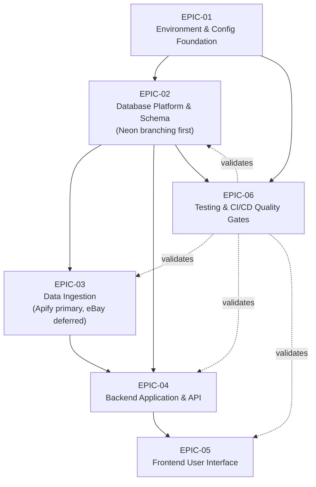

# Technical Specification

# 0. Agent Action Plan

## 0.1 Intent Clarification

### 0.1.1 Core Objective

Based on the provided requirements, the Blitzy platform understands that the objective is to **decompose the CompVault application build into a complete, INVEST-compliant Agile backlog of EPIC → FEATURE → STORY markdown ticket files**, organized into "large sections by epics," and saved to a `tickets/` directory at the repository root. The repository today is a greenfield documentation-and-actor scaffold — it contains only `README.md`, a `docs/` folder, and a self-contained `apify/` actor [README.md][docs/schema.sql][apify/package.json] — so this backlog is the forward-looking plan that downstream engineering will execute to construct the application.

The requirements, restated with technical precision:

- **Slice the build into epic-sized sections** that mirror the user's own example — testing, database, backend, frontend — and add the cross-cutting sections the codebase demands (an environment/configuration foundation and a data-ingestion pipeline).
- **Embed environment access and step-by-step configuration into every section.** Each epic must enumerate the environment access required, cite the canonical Blitzy environments reference (`https://docs.blitzy.com/administration/environments`), and provide step-by-step instructions to configure that environment **before** implementation work proceeds.
- **Treat Neon database branching as a hard prerequisite.** The database section must establish Neon branching first, and document the distinct connection strings — the pooled runtime connection versus the unpooled DDL/migration connection, plus per-branch connection strings for testing [§8.2.2.2][§8.2.2.3].
- **Flag the local-environment uncertainty.** The user notes the existing local Neon setup "may or may not be enough" for local access testing; this uncertainty must be surfaced explicitly as an open verification item rather than silently assumed.
- **Make Apify the primary ingestion path now, and defer the eBay API.** The user will "use apify primarily and hold off on ebay api … until i get approved access," so the ingestion section must treat the existing Apify actor as the primary source and document the eBay Browse/Marketplace-Insights API integration as a deferred, access-blocked item that is tracked but not actively built.

Implicit requirements surfaced from these directives:

- A deterministic, zero-padded, three-level file-naming and nesting scheme (`EPIC-NN` → `FEATURE-NN-MM` → `STORY-NN-MM-SS`) with kebab-case slugs, so the backlog is navigable and machine-parseable.
- INVEST-aligned stories with quantified Given/When/Then (BDD) acceptance criteria that strictly avoid the prohibited vague terms (approximately, several, various, adequate, appropriate, properly, correctly, efficiently, quickly, easily, user-friendly, reasonable, sufficient).
- A dedicated environment-access/configuration feature inside *each* epic, so the "per-section environment" requirement is satisfied locally rather than only once globally.
- Encoding of the latent multi-tenancy seam (`getUserId()` returning a seeded operator user in v1) so backend stories thread `userId` from day one even though authentication is deferred [§1.2].
- Encoding of the platform's compliance posture: official APIs only from the main application, with the Apify actor as the single sanctioned out-of-band scraping exception [§1.2][§1.3].

Dependencies and prerequisites: the backlog itself depends on no runtime installation (it is pure markdown), but its *content* must accurately reference the intended stack and the external platforms whose access each epic enumerates (Blitzy, Neon, Vercel, GitHub Actions, Apify; eBay deferred).

### 0.1.2 Task Categorization

- **Primary task type:** Documentation / planning-artifact generation (Agile backlog authoring). No application source code, configuration, migration, or workflow is created, modified, or executed by this task — the sole filesystem output is markdown under `tickets/`.
- **Secondary aspects:** Requirements engineering (INVEST + BDD Given/When/Then decomposition); environment and DevOps documentation (Blitzy environments, Neon branching topology, secrets management); and scope sequencing (Apify-primary versus eBay-deferred).
- **Scope classification:** Cross-cutting planning artifact. The backlog spans the entire intended codebase (database, backend, frontend, ingestion, testing, environment), but its filesystem footprint is **isolated** to the new `tickets/` tree; no existing file is altered.

### 0.1.3 Special Instructions and Constraints

The following directives are captured verbatim or near-verbatim and treated as binding constraints on the generated tickets:

- **User Objective (verbatim):** *"Build out the application into large sections by epics (example: testing, database, backend, frontend or testing at each step). For each section, include the environment access that is needed (https://docs.blitzy.com/administration/environments) and step-by-step instructions on how to configure the environment before proceeding. For neon database, there are branching that needs to be setup first and different connections i believe for testing. There is currently local environment setup in the environment for neon which may or may not be enough for local access testing. I will also be using apify primarily and hold off on ebay api for now until i get approved access."*
- **User Example (preserved):** the user's epic examples — *"testing, database, backend, frontend or testing at each step"* — are honored directly: testing, database, backend, and frontend each become epics, and "testing at each step" is realized both through a dedicated Testing & CI/CD epic and through testing sub-tasks woven into every story's Definition of Done.
- **Methodological requirements:** stories follow the INVEST principle and the "As a [role], I want [capability], so that [benefit]" template; acceptance criteria use the Given/When/Then BDD format and must be specific and measurable.
- **Hard prohibition:** the prohibited vague-quality terms must not appear in acceptance criteria.
- **Sequencing constraint:** Neon branching is provisioned before any testing or data-write story can run.
- **Deferral constraint:** the eBay API integration is documented but not actively scheduled until the user obtains approved access.
- **Web search requirements:** research was required to (a) validate the INVEST/BDD acceptance-criteria methodology used to structure every story, and (b) validate the Neon copy-on-write branching CI workflow used to structure the database and testing epics. Both were completed and are summarized in §0.2.2.

### 0.1.4 Technical Interpretation

These requirements translate to the following technical implementation strategy. Each high-level directive maps to a concrete authoring action using the form "To [achieve goal], we will [create/modify] [specific components] by [specific approach]":

- **To slice the build into epic-sized sections,** we will create six epics — Environment & Configuration Foundation, Database Platform & Schema, Data Ingestion Pipeline, Backend Application & API, Frontend User Interface, and Testing & CI/CD Quality Gates — by mapping the user's example sections plus the cross-cutting concerns evident in the system overview onto the CompVault Phase 0 + Phase 1 MVP scope [§1.3].
- **To embed environment access per section,** we will create one "Environment Access & Configuration" feature inside every epic, each authoring stories that cite `https://docs.blitzy.com/administration/environments` and enumerate the toolchain, variables, and step-by-step configuration for that epic's target platform.
- **To make Neon branching a prerequisite,** we will create a Database epic whose first feature provisions the Neon project and branching topology (production, per-PR preview, per-CI ephemeral, local dev) and documents pooled `DATABASE_URL` versus unpooled `DATABASE_URL_UNPOOLED` connections [§8.2.2.2], ordered as an upstream dependency of the Testing and Ingestion epics.
- **To surface the local-environment uncertainty,** we will author a dedicated story (document-pooled-and-unpooled-connections) whose acceptance criteria require verifying that the existing local Neon connection is sufficient for local and test access and documenting any gap discovered.
- **To make Apify primary and defer eBay,** we will create a Data Ingestion epic whose primary feature integrates the existing `apify/` actor as the live ingestion source, while a single tracked story documents the deferred, access-blocked eBay API integration without making it a dependency of any active story.

## 0.2 Repository Scope Discovery

### 0.2.1 Comprehensive File Analysis

A depth-three traversal of the repository (excluding `.git`) confirms that CompVault is a **greenfield** project whose only artifacts are a banner README, two documents, and one standalone Apify actor. Critically, **no `tickets/` directory exists yet**, so every backlog file is a new creation, and **no application scaffold exists** — there is no root `package.json`, `tsconfig.json`, `next.config.*`, or `drizzle.config.*`, and no `app/`, `db/`, `lib/`, `jobs/`, `scripts/`, or `.github/` directories. The complete existing inventory is:

| Path | Type | Role in This Task |
|------|------|-------------------|
| `README.md` | Markdown banner | Unchanged; out of scope |
| `docs/schema.sql` | PostgreSQL DDL (~413 lines) | REFERENCE — canonical schema authority for the future `db/schema.ts` [docs/schema.sql] |
| `docs/Star-Wars-Card-Price-Tracker-PRD.md` | Product requirements doc | REFERENCE — product/domain authority across epics [docs/Star-Wars-Card-Price-Tracker-PRD.md] |
| `apify/package.json` | Node manifest | REFERENCE — `name: ebay-sold-listings`, `type: module`, `engines.node >=18`, deps `apify ^3.2.6` / `crawlee ^3.11.5` / `cheerio ^1.0.0` [apify/package.json:dependencies] |
| `apify/src/main.js` | Actor entrypoint | REFERENCE — ingestion pattern for EPIC-03 |
| `apify/Dockerfile` | Container build | REFERENCE — base `apify/actor-node:20` (container Node 20) |
| `apify/.actor/actor.json`, `apify/.actor/input_schema.json` | Actor metadata + input contract | REFERENCE — actor launch contract |
| `apify/README.md`, `apify/.dockerignore`, `apify/.gitignore` | Actor support files | REFERENCE / unchanged |

Because the deliverable is a backlog, the "affected files" are the markdown tickets to be created, not application files. The file-discovery exercise therefore establishes (a) which existing files serve as REFERENCE patterns and (b) the absence of any `.env*` template anywhere — meaning the creation of `.env.example` is itself an in-scope story in the Environment epic. No `.blitzyignore` files exist anywhere in the repository, so no paths are excluded from analysis.

The intended (not-yet-existing) application layout that the backlog plans to construct — `app/`, `db/`, `lib/`, `jobs/`, `scripts/`, `.github/workflows/` — is drawn from the technical specification's described repository structure for the TypeScript application [§3.2].

### 0.2.2 Web Search Research Conducted

Two research threads were conducted to validate the methodology and the platform workflow underpinning the backlog:

- **INVEST and Given/When/Then acceptance-criteria best practices.** Research confirmed the INVEST attributes (Independent, Negotiable, Valuable, Estimable, Small, Testable) as the standard quality bar for user stories, and the Given/When/Then BDD format as the prevailing structure for acceptance criteria. The literature is explicit that criteria must be specific and measurable — the canonical guidance to replace "loads quickly" with a quantified target such as "loads within 2 seconds" directly validates this backlog's prohibition on vague terms and its requirement that every criterion be independently pass/fail testable.
- **Neon Postgres branching for CI and testing.** Research confirmed that a Neon branch is a copy-on-write clone of its parent; that the standard CI pattern creates a branch from the production/main branch at pipeline start (via a GitHub Action), points the test job's `DATABASE_URL` at that branch's connection string, runs migrations and tests, then deletes the branch on completion; and that the Vercel integration can auto-create a Neon branch per preview deployment. This validates the user's instruction that Neon branching be "set up first" and that "different connections" exist for testing — both the per-branch connection strings and the pooled-versus-unpooled split documented in the specification [§8.2.2.2][§8.2.2.3].

These findings shape the Database and Testing epics and the structure of every story, but introduce no new dependency on the deliverable itself.

### 0.2.3 Existing Infrastructure Assessment

- **Project structure and organization.** The repository is intentionally sparse: documentation (`docs/`) plus one operational component (`apify/`). The main Next.js + Drizzle + Neon application is entirely unbuilt, which is consistent with the specification's characterization of the project as greenfield with no legacy code and no user base [§1.2].
- **Existing patterns and conventions to follow.** The only operational code is the Apify actor, which establishes the ingestion conventions and the Node `>=18` engine floor [apify/package.json:engines.node]. `docs/schema.sql` is the canonical data model the future ORM schema must mirror [docs/schema.sql].
- **Build and deployment configuration.** No Infrastructure-as-Code is present; the platform model is per-platform managed configuration across Vercel (application), Neon (database), GitHub Actions (CI and cron jobs), and the Apify Platform (scraper), plus one local workstation for the Topps PDF download [§8.2.1.1]. These five environment targets map directly to the per-epic "environment access needed" content.
- **Testing infrastructure present.** None. No test code, test runner configuration, or CI workflow exists today; the specification's testing strategy is forward-looking and targets Vitest for unit and integration tests with a per-CI Neon branch as the test database [§6.6]. This confirms the Testing & CI/CD epic builds the harness from zero.
- **Documentation system in use.** Plain markdown in `docs/`, plus the actor's own `README.md`. The new backlog therefore adopts markdown as its native format, consistent with the repository's conventions.

## 0.3 Implementation Design

### 0.3.1 Technical Approach

The backlog is constructed as a six-epic decomposition of the CompVault Phase 0 + Phase 1 MVP [§1.3], where every epic carries exactly three features and every feature carries two to five INVEST stories, producing **6 epics, 18 features, and 57 stories (81 markdown files total)**. Each epic embeds an environment-access feature that cites `https://docs.blitzy.com/administration/environments` and supplies step-by-step configuration for that epic's target platform.

The primary objectives map to authoring actions as follows:

- **Achieve a clear environment foundation** by creating EPIC-01 (Environment & Configuration Foundation), which provisions the Blitzy environments, the application scaffold, and the secrets/`.env.example` baseline that every later epic relies on.
- **Achieve a branch-isolated database** by creating EPIC-02 (Database Platform & Schema), which provisions the Neon project and branching topology first, then the Drizzle schema mirroring `docs/schema.sql` [docs/schema.sql], then the pooled access layer and seed data.
- **Achieve live data ingestion** by creating EPIC-03 (Data Ingestion Pipeline), which integrates the existing Apify actor as the primary source, adds the two-stage extraction and confidence-gated matching, and schedules daily ingestion — while explicitly deferring the eBay API.
- **Achieve a serving backend and UI** by creating EPIC-04 (Backend Application & API) and EPIC-05 (Frontend User Interface) for character search, the two-column digital|physical results, card detail with a price-history chart, and the operator review-queue workbench [§1.2].
- **Achieve quality assurance** by creating EPIC-06 (Testing & CI/CD Quality Gates), which builds the Vitest harness, the unit/integration suites, and the GitHub Actions pipeline with coverage and branch-protection gates [§6.6].

The logical implementation flow (a dependency order, not a timeline) is: first establish the environment foundation in EPIC-01; next establish branch-isolated data in EPIC-02 (Neon branching is the upstream gate); then ingest data via Apify in EPIC-03; then serve it through EPIC-04 and present it through EPIC-05; and ensure quality throughout via EPIC-06, which depends on the environment and on a Neon test branch.

### 0.3.2 Component Impact Analysis

In this backlog the "components" are the epics and the application areas each one documents. There are no direct modifications to existing application code (none exists); the impact is the set of new ticket artifacts and the dependency relationships among them.

- **Direct artifacts created:** six epic files, eighteen feature files, and fifty-seven story files under `tickets/` (enumerated exhaustively in §0.4).
- **Indirect dependencies between epics:** EPIC-02's branching feature is an upstream dependency of EPIC-06's per-CI test-branch story and of every EPIC-03 data-write story; EPIC-04 depends on EPIC-02's access layer and on EPIC-03's ingested data; EPIC-05 depends on EPIC-04's endpoints.
- **Reference components (read, never modified):** `docs/schema.sql` informs the Drizzle schema story; `apify/*` informs the ingestion stories and fixes the Node version floor [apify/package.json:engines.node]; `docs/Star-Wars-Card-Price-Tracker-PRD.md` informs product-facing stories.
- **New cross-cutting concern introduced:** a per-epic environment-access feature, created so the user's "environment access for each section" requirement is satisfied locally in every epic rather than centralized once.

### 0.3.3 User Interface Design

This task produces no user interface; it generates markdown planning artifacts only. However, the backlog *documents* the MVP's intended UI within EPIC-05, whose stories capture the key UI goals drawn from the system overview: a character-first search box with autocomplete; a two-column results layout separating digital and physical variants; a card/variation detail page bearing a price-history chart (sparkline with a 90-day/1-year toggle and trend indicator) and a sales table; "last updated" freshness timestamps; and an operator-only review-queue workbench [§1.2]. No design system or component library is named in the requirements, so no design-system compliance analysis applies.

### 0.3.4 User-Provided Examples Integration

The user provided one illustrative example — the epic categories *"testing, database, backend, frontend or testing at each step."* This example maps to the implementation as follows:

- *"database"* → EPIC-02 (Database Platform & Schema).
- *"backend"* → EPIC-04 (Backend Application & API).
- *"frontend"* → EPIC-05 (Frontend User Interface).
- *"testing" / "testing at each step"* → EPIC-06 (Testing & CI/CD Quality Gates) as the dedicated section, **plus** a testing sub-task and a test-oriented Definition-of-Done line embedded in every story across all epics, honoring the "at each step" phrasing.
- The two sections the example implies but does not name — environment configuration and data ingestion — are added as EPIC-01 and EPIC-03 because the user's own surrounding instructions (per-section environment access; Neon branching; Apify-primary ingestion) require them.

### 0.3.5 Critical Implementation Details

- **Deterministic naming pattern:** epics are `tickets/EPIC-NN-<slug>.md`; features are `tickets/EPIC-NN/FEATURE-NN-MM-<slug>.md`; stories are `tickets/EPIC-NN/FEATURE-NN-MM/STORY-NN-MM-SS-<slug>.md`. Numbers are zero-padded; the parent number is embedded in every child; slugs are kebab-case.
- **Story schema:** each story file contains a Title, a "As a … I want … so that …" statement with a concrete named role, four to eight Given/When/Then acceptance criteria (covering at least one input-validation, one valid-output, one error-handling, and one edge-case scenario), action-verb sub-tasks with `@assignee`, three to five edge cases, dependencies, Fibonacci estimation guidance, and a Definition of Done.
- **Quantified acceptance criteria:** criteria specify measurable thresholds drawn from the specification where applicable — for example, the daily ingestion budget cap of ≤5,000 eBay Browse calls with a halt at 4,500 [§1.2], the cron schedule `0 8 * * *` [§1.2], and coverage thresholds (parsers/validators/score ≥90%, API/jobs ≥75%, Apify helpers ≥90%, UI ≥50%) [§6.6] — and avoid all prohibited vague terms.
- **Connection-string discipline:** database and migration stories explicitly distinguish the pooled `DATABASE_URL` used at runtime from the unpooled `DATABASE_URL_UNPOOLED` required for DDL/migrations, because mixing them breaks migrations [§3.3.2][§8.2.2.2].
- **Compliance encoding:** ingestion stories encode that the main application calls official APIs only and that the Apify actor is the single sanctioned out-of-band scraping exception, with no LLM calls in request handlers (batch jobs only) [§1.2][§1.3].
- **Latent multi-tenancy:** backend stories thread `userId` from the `getUserId()` seam (seeded operator user in v1) so the schema and handlers remain multi-tenant-ready though authentication is deferred to Phase 3 [§1.2].
- **Error handling and edge cases:** each story's edge-case section addresses Empty/Null, Boundary, and Invalid inputs (and Concurrent access where relevant), e.g., the idempotent `raw_listing` upsert keyed on `(source, source_item_id)` to tolerate re-runs [§8.2].

## 0.4 File Transformation Mapping

### 0.4.1 File-by-File Execution Plan

Every ticket file below is a **CREATE** (the `tickets/` tree does not exist). Tables are grouped by epic; within each epic the target epic file is listed first, then its feature files, then its story files. Existing repository files used as patterns are listed separately in the REFERENCE table (§0.4.2). Transformation modes: **CREATE** = new file, **REFERENCE** = existing file used as a pattern/authority (never modified).

**EPIC-01 — Environment & Configuration Foundation** (Blitzy environments, app scaffold, secrets baseline)

| Target File | Transformation | Source/Reference | Purpose/Changes |
|-------------|----------------|------------------|-----------------|
| `tickets/EPIC-01-environment-and-configuration-foundation.md` | CREATE | §0.1, §8.2 | Epic: establish Blitzy environments, application scaffold, and secrets baseline that all later epics depend on |
| `tickets/EPIC-01/FEATURE-01-01-blitzy-environment-provisioning.md` | CREATE | Blitzy env doc | Feature: provision Dev/Staging/Prod Blitzy environments and attach to project |
| `tickets/EPIC-01/FEATURE-01-02-application-scaffolding-and-tooling.md` | CREATE | §3.2, §3.3 | Feature: initialize Next.js + TypeScript scaffold, linting, and directory layout |
| `tickets/EPIC-01/FEATURE-01-03-secrets-and-variable-management.md` | CREATE | §8.2.2.2 | Feature: author `.env.example` and configure Vercel/GitHub secrets |
| `tickets/EPIC-01/FEATURE-01-01/STORY-01-01-01-create-blitzy-environments.md` | CREATE | Blitzy env doc | Story: create environments per target; cite `docs.blitzy.com/administration/environments` |
| `tickets/EPIC-01/FEATURE-01-01/STORY-01-01-02-define-secrets-and-variables.md` | CREATE | §8.2.2.2 | Story: define plaintext vars and encrypted secrets in the Blitzy dashboard |
| `tickets/EPIC-01/FEATURE-01-01/STORY-01-01-03-attach-environments-and-validate-build.md` | CREATE | Blitzy env doc | Story: attach environments to the project and validate with a test build |
| `tickets/EPIC-01/FEATURE-01-02/STORY-01-02-01-initialize-nextjs-typescript-project.md` | CREATE | §3.3.1 | Story: initialize Next.js App Router + TypeScript at repo root |
| `tickets/EPIC-01/FEATURE-01-02/STORY-01-02-02-configure-eslint-and-typecheck.md` | CREATE | §6.6 | Story: configure ESLint and `tsc --noEmit` strict typecheck baseline |
| `tickets/EPIC-01/FEATURE-01-02/STORY-01-02-03-establish-directory-layout.md` | CREATE | §3.2 | Story: establish `app/`, `db/`, `lib/`, `jobs/`, `scripts/`, `.github/` layout |
| `tickets/EPIC-01/FEATURE-01-03/STORY-01-03-01-author-env-example.md` | CREATE | §8.2.2.2 | Story: author `.env.example` with all required variables (none exists today) |
| `tickets/EPIC-01/FEATURE-01-03/STORY-01-03-02-configure-vercel-env-vars.md` | CREATE | §8.2.2.2 | Story: configure Vercel project environment variables |
| `tickets/EPIC-01/FEATURE-01-03/STORY-01-03-03-configure-github-actions-secrets.md` | CREATE | §8.2.2.2 | Story: configure GitHub Actions encrypted secrets |

**EPIC-02 — Database Platform & Schema** (Neon branching first, Drizzle schema, access layer)

| Target File | Transformation | Source/Reference | Purpose/Changes |
|-------------|----------------|------------------|-----------------|
| `tickets/EPIC-02-database-platform-and-schema.md` | CREATE | §1.3.1.4, §8.2.2.3 | Epic: provision Neon, branching topology, Drizzle schema, and access layer |
| `tickets/EPIC-02/FEATURE-02-01-neon-project-and-branching-topology.md` | CREATE | §8.2.2.3, Neon docs | Feature: provision Neon project and configure branching (the hard prerequisite) |
| `tickets/EPIC-02/FEATURE-02-02-drizzle-schema-and-migrations.md` | CREATE | `docs/schema.sql` | Feature: author Drizzle schema and migration pipeline |
| `tickets/EPIC-02/FEATURE-02-03-data-access-layer-and-seed-data.md` | CREATE | §3.3.2, env setup | Feature: pooled Neon client, `getUserId` seam, catalog seed |
| `tickets/EPIC-02/FEATURE-02-01/STORY-02-01-01-provision-neon-project-and-production-branch.md` | CREATE | §8.2.2.3 | Story: provision Neon project and production branch; cite Blitzy env doc |
| `tickets/EPIC-02/FEATURE-02-01/STORY-02-01-02-configure-per-pr-preview-branches.md` | CREATE | Neon/Vercel docs | Story: configure per-PR preview branch automation |
| `tickets/EPIC-02/FEATURE-02-01/STORY-02-01-03-configure-per-ci-ephemeral-branches.md` | CREATE | Neon docs, §6.6 | Story: configure per-CI ephemeral branch create/teardown |
| `tickets/EPIC-02/FEATURE-02-01/STORY-02-01-04-document-pooled-and-unpooled-connections.md` | CREATE | §8.2.2.2 | Story: document pooled vs unpooled connections; verify local setup sufficiency (flag uncertainty) |
| `tickets/EPIC-02/FEATURE-02-02/STORY-02-02-01-author-drizzle-schema.md` | CREATE | `docs/schema.sql` | Story: author `db/schema.ts` mirroring the canonical SQL enums and tables |
| `tickets/EPIC-02/FEATURE-02-02/STORY-02-02-02-configure-drizzle-kit-and-initial-migration.md` | CREATE | §3.3.2 | Story: configure `drizzle-kit`; generate the initial migration |
| `tickets/EPIC-02/FEATURE-02-02/STORY-02-02-03-create-migration-rehearsal-workflow.md` | CREATE | §6.6.2 | Story: create `migrate.yml` rehearsing migrations on a Neon branch (unpooled URL) |
| `tickets/EPIC-02/FEATURE-02-03/STORY-02-03-01-implement-pooled-neon-client.md` | CREATE | env setup, §3.3.2 | Story: implement the pooled Neon client (`@neondatabase/serverless` + `ws`) |
| `tickets/EPIC-02/FEATURE-02-03/STORY-02-03-02-implement-getuserid-seam.md` | CREATE | §1.2 | Story: implement `getUserId()` returning the seeded operator user |
| `tickets/EPIC-02/FEATURE-02-03/STORY-02-03-03-author-catalog-seed-script.md` | CREATE | `docs/schema.sql` | Story: author catalog seed (sets/characters/cards baseline) |

**EPIC-03 — Data Ingestion Pipeline** (Apify primary; eBay API deferred)

| Target File | Transformation | Source/Reference | Purpose/Changes |
|-------------|----------------|------------------|-----------------|
| `tickets/EPIC-03-data-ingestion-pipeline.md` | CREATE | §1.2, §1.3 | Epic: Apify-primary ingestion, extraction/matching, scheduled orchestration |
| `tickets/EPIC-03/FEATURE-03-01-apify-actor-integration.md` | CREATE | `apify/src/main.js` | Feature: integrate the existing actor as the primary ingestion source |
| `tickets/EPIC-03/FEATURE-03-02-extraction-and-matching.md` | CREATE | §1.2 | Feature: two-stage extraction and confidence-gated matching |
| `tickets/EPIC-03/FEATURE-03-03-scheduled-ingestion-orchestration.md` | CREATE | §1.2, §8.2 | Feature: scheduled ingestion, heartbeat, budget cap, eBay deferral |
| `tickets/EPIC-03/FEATURE-03-01/STORY-03-01-01-configure-apify-access-and-token.md` | CREATE | §8.2.2.2 | Story: configure Apify Platform access and `APIFY_TOKEN`; cite Blitzy env doc |
| `tickets/EPIC-03/FEATURE-03-01/STORY-03-01-02-invoke-actor-and-persist-raw-listings.md` | CREATE | `apify/.actor/input_schema.json` | Story: invoke the actor and persist results to `raw_listing` |
| `tickets/EPIC-03/FEATURE-03-01/STORY-03-01-03-implement-idempotent-raw-listing-upsert.md` | CREATE | §8.2 | Story: implement idempotent upsert keyed on `(source, source_item_id)` |
| `tickets/EPIC-03/FEATURE-03-02/STORY-03-02-01-implement-regex-first-parser.md` | CREATE | §1.2 | Story: implement the cheap regex-first title parser |
| `tickets/EPIC-03/FEATURE-03-02/STORY-03-02-02-implement-llm-fallback-parser.md` | CREATE | §1.2 | Story: implement LLM fallback with strict JSON schema (batch-only) |
| `tickets/EPIC-03/FEATURE-03-02/STORY-03-02-03-implement-confidence-gated-matcher.md` | CREATE | §1.2 | Story: auto-commit high-confidence sales; route low-confidence to review queue |
| `tickets/EPIC-03/FEATURE-03-02/STORY-03-02-04-implement-self-healing-reclustering.md` | CREATE | §1.2 | Story: implement periodic re-clustering of duplicate digital variations |
| `tickets/EPIC-03/FEATURE-03-03/STORY-03-03-01-create-scheduled-ingestion-workflow.md` | CREATE | §1.2 | Story: create `ingest.yml` cron (`0 8 * * *`) + `workflow_dispatch` |
| `tickets/EPIC-03/FEATURE-03-03/STORY-03-03-02-implement-heartbeat-and-call-budget-cap.md` | CREATE | §1.2 | Story: ingestion-run heartbeat and budget cap (≤5,000/day, halt at 4,500) |
| `tickets/EPIC-03/FEATURE-03-03/STORY-03-03-03-document-deferred-ebay-api-integration.md` | CREATE | §1.3 | Story: document the deferred eBay Browse/Insights integration (BLOCKED on approved access) |

**EPIC-04 — Backend Application & API** (search/detail/history endpoints, review-queue API)

| Target File | Transformation | Source/Reference | Purpose/Changes |
|-------------|----------------|------------------|-----------------|
| `tickets/EPIC-04-backend-application-and-api.md` | CREATE | §1.2, §3.3.1 | Epic: Next.js API foundation, search/detail endpoints, review-queue API |
| `tickets/EPIC-04/FEATURE-04-01-backend-foundation-and-environment-access.md` | CREATE | §3.3.1 | Feature: Vercel runtime, API scaffolding with `getUserId`, input validation |
| `tickets/EPIC-04/FEATURE-04-02-search-and-detail-endpoints.md` | CREATE | §1.2 | Feature: search, two-column results, detail, and price-history endpoints |
| `tickets/EPIC-04/FEATURE-04-03-operator-review-queue-api.md` | CREATE | §1.2 | Feature: review-queue and counterpart-override endpoints |
| `tickets/EPIC-04/FEATURE-04-01/STORY-04-01-01-configure-vercel-runtime-and-env-access.md` | CREATE | §8.2.1.1 | Story: configure Vercel deployment + env access; cite Blitzy env doc |
| `tickets/EPIC-04/FEATURE-04-01/STORY-04-01-02-implement-api-scaffolding-with-getuserid.md` | CREATE | §1.2 | Story: implement API route scaffolding threading `getUserId()` |
| `tickets/EPIC-04/FEATURE-04-01/STORY-04-01-03-implement-query-parameter-validation.md` | CREATE | §6.6 | Story: implement input validation for query parameters |
| `tickets/EPIC-04/FEATURE-04-02/STORY-04-02-01-implement-character-search-autocomplete.md` | CREATE | §1.2 | Story: implement character search + autocomplete endpoint |
| `tickets/EPIC-04/FEATURE-04-02/STORY-04-02-02-implement-two-column-results-endpoint.md` | CREATE | §1.2 | Story: implement digital|physical two-column results endpoint |
| `tickets/EPIC-04/FEATURE-04-02/STORY-04-02-03-implement-card-detail-and-sales-table.md` | CREATE | `docs/schema.sql` | Story: implement card/variation detail with sales table |
| `tickets/EPIC-04/FEATURE-04-02/STORY-04-02-04-implement-price-history-and-trend.md` | CREATE | §1.2 | Story: implement 90d/1y price-history + trend backed by `valuation_cache` |
| `tickets/EPIC-04/FEATURE-04-03/STORY-04-03-01-implement-review-queue-endpoints.md` | CREATE | §1.2 | Story: implement review-queue list + resolve endpoints |
| `tickets/EPIC-04/FEATURE-04-03/STORY-04-03-02-implement-counterpart-override-endpoint.md` | CREATE | §1.2 | Story: implement operator counterpart-override endpoint |

**EPIC-05 — Frontend User Interface** (search, results, detail chart, review workbench)

| Target File | Transformation | Source/Reference | Purpose/Changes |
|-------------|----------------|------------------|-----------------|
| `tickets/EPIC-05-frontend-user-interface.md` | CREATE | §1.2 | Epic: search/results experience, detail chart, review-queue workbench UI |
| `tickets/EPIC-05/FEATURE-05-01-frontend-foundation-and-environment-access.md` | CREATE | §8.2.1.1 | Feature: Vercel preview env access and application shell |
| `tickets/EPIC-05/FEATURE-05-02-search-and-results-experience.md` | CREATE | §1.2 | Feature: search input, two-column results, freshness timestamps |
| `tickets/EPIC-05/FEATURE-05-03-detail-and-review-workbench-ui.md` | CREATE | §1.2 | Feature: detail page, price-history chart, review workbench UI |
| `tickets/EPIC-05/FEATURE-05-01/STORY-05-01-01-configure-vercel-preview-and-env-access.md` | CREATE | §8.2.1.1 | Story: configure Vercel preview deployments + env access; cite Blitzy env doc |
| `tickets/EPIC-05/FEATURE-05-01/STORY-05-01-02-implement-application-shell.md` | CREATE | §1.2 | Story: implement the application layout/shell |
| `tickets/EPIC-05/FEATURE-05-02/STORY-05-02-01-implement-search-input-with-autocomplete.md` | CREATE | §1.2 | Story: implement character search input with autocomplete |
| `tickets/EPIC-05/FEATURE-05-02/STORY-05-02-02-implement-two-column-results-view.md` | CREATE | §1.2 | Story: implement digital|physical two-column results view |
| `tickets/EPIC-05/FEATURE-05-02/STORY-05-02-03-implement-last-updated-timestamps.md` | CREATE | §1.2 | Story: implement "last updated" freshness timestamps |
| `tickets/EPIC-05/FEATURE-05-03/STORY-05-03-01-implement-card-detail-page.md` | CREATE | §1.2 | Story: implement card/variation detail page with sales table |
| `tickets/EPIC-05/FEATURE-05-03/STORY-05-03-02-implement-price-history-chart.md` | CREATE | §1.2 | Story: implement price-history chart (sparkline + 90d/1y toggle + trend) |
| `tickets/EPIC-05/FEATURE-05-03/STORY-05-03-03-implement-review-queue-workbench-ui.md` | CREATE | §1.2 | Story: implement the operator review-queue workbench UI |

**EPIC-06 — Testing & CI/CD Quality Gates** (Vitest harness, suites, pipeline + gates)

| Target File | Transformation | Source/Reference | Purpose/Changes |
|-------------|----------------|------------------|-----------------|
| `tickets/EPIC-06-testing-and-cicd-quality-gates.md` | CREATE | §6.6 | Epic: test harness, unit/integration suites, CI/CD pipeline and gates |
| `tickets/EPIC-06/FEATURE-06-01-test-harness-and-environment-access.md` | CREATE | §6.6 | Feature: Vitest harness, fixtures/mocks, Neon test-branch wiring |
| `tickets/EPIC-06/FEATURE-06-02-unit-and-integration-suites.md` | CREATE | §6.6 | Feature: unit, integration, and Apify helper test suites |
| `tickets/EPIC-06/FEATURE-06-03-cicd-pipeline-and-quality-gates.md` | CREATE | §6.6 | Feature: `ci.yml`, coverage/secret gates, branch protection |
| `tickets/EPIC-06/FEATURE-06-01/STORY-06-01-01-configure-vitest-and-env-access.md` | CREATE | §6.6 | Story: configure Vitest for the TS app and JS actor + env access; cite Blitzy env doc |
| `tickets/EPIC-06/FEATURE-06-01/STORY-06-01-02-establish-fixtures-and-boundary-mocks.md` | CREATE | §6.6 | Story: establish `__fixtures__` (eBay/LLM JSON, Apify HTML) and boundary mocks |
| `tickets/EPIC-06/FEATURE-06-01/STORY-06-01-03-wire-integration-tests-to-neon-branch.md` | CREATE | §6.6, §8.2.2.3 | Story: wire integration tests to a per-CI Neon branch (depends on EPIC-02 branching) |
| `tickets/EPIC-06/FEATURE-06-02/STORY-06-02-01-author-unit-tests-parsers-validators-score.md` | CREATE | §6.6 | Story: author unit tests for parsers/validators/score (≥90%) |
| `tickets/EPIC-06/FEATURE-06-02/STORY-06-02-02-author-integration-tests-api-routes.md` | CREATE | §6.6 | Story: author API integration tests against a Neon branch (≥75%) |
| `tickets/EPIC-06/FEATURE-06-02/STORY-06-02-03-author-apify-helper-tests.md` | CREATE | `apify/src/main.js` | Story: author Apify helper tests against HTML fixtures (≥90%) |
| `tickets/EPIC-06/FEATURE-06-03/STORY-06-03-01-create-ci-workflow.md` | CREATE | §6.6 | Story: create `ci.yml` (typecheck + ESLint + Vitest) on every PR |
| `tickets/EPIC-06/FEATURE-06-03/STORY-06-03-02-enforce-coverage-and-secret-checks.md` | CREATE | §6.6 | Story: enforce coverage thresholds and secret-presence assertions |
| `tickets/EPIC-06/FEATURE-06-03/STORY-06-03-03-configure-branch-protection.md` | CREATE | §6.6 | Story: configure branch protection on `main` (green `ci.yml`/`migrate.yml`, ≥1 approval) |

### 0.4.2 Reference Files (Existing — Never Modified)

| Target File | Transformation | Source/Reference | Purpose/Changes |
|-------------|----------------|------------------|-----------------|
| `docs/schema.sql` | REFERENCE | `docs/schema.sql` | Canonical PostgreSQL schema; authority for the Drizzle schema and detail/seed stories [docs/schema.sql] |
| `apify/src/main.js` | REFERENCE | `apify/src/main.js` | Ingestion-pattern authority for EPIC-03 and Apify helper tests |
| `apify/package.json` | REFERENCE | `apify/package.json` | Node `>=18` engine floor and pinned actor dependency versions [apify/package.json:dependencies] |
| `apify/Dockerfile` | REFERENCE | `apify/Dockerfile` | Container Node 20 base for actor environment configuration |
| `apify/.actor/input_schema.json` | REFERENCE | `apify/.actor/input_schema.json` | Actor launch-input contract referenced by the invocation story |
| `docs/Star-Wars-Card-Price-Tracker-PRD.md` | REFERENCE | `docs/Star-Wars-Card-Price-Tracker-PRD.md` | Product/domain authority for product-facing stories |
| `https://docs.blitzy.com/administration/environments` | REFERENCE | External URL | Canonical environment-configuration reference cited by every epic's environment-access feature |

### 0.4.3 New Files Detail

- **Epic files (6):** each contains an Epic Title (Action + Object + Outcome, ≤255 chars), an Epic Summary (2–3 sentences with business value and scope boundaries), a Features Index linking the three child features, Dependencies (upstream epics), and an epic-level Definition of Done.
- **Feature files (18):** each contains a Feature Title, a Feature Summary, a User Stories Index linking its child stories, Dependencies, and a feature-level Definition of Done.
- **Story files (57):** each contains a Story Title, a "As a [role], I want [capability], so that [benefit]" statement, four to eight Given/When/Then acceptance criteria, action-verb sub-tasks with `@assignee`, three to five edge cases, Dependencies, Story Estimation Guidance (Effort/Complexity/Uncertainty + Fibonacci points), and a story-level Definition of Done.
- **Content type for all 81 files:** documentation (markdown). Based on the structural template defined in the requirements; no application content is generated.

### 0.4.4 Files to Modify Detail

None. No existing repository file is modified by this task. `README.md`, `docs/schema.sql`, `docs/Star-Wars-Card-Price-Tracker-PRD.md`, and all `apify/*` files remain byte-for-byte unchanged; the latter are consumed only as REFERENCE inputs.

### 0.4.5 Configuration and Documentation Updates

- **Configuration changes:** none to existing configuration files. The backlog *documents* future configuration (`.env.example`, `drizzle.config.ts`, `ci.yml`, `migrate.yml`, `ingest.yml`, Vercel/Neon/GitHub/Apify dashboards) inside the relevant story files, but creates no such files in this task.
- **Documentation updates:** the entire output is new documentation under `tickets/`. No edits to `docs/` or `README.md` are made.

### 0.4.6 Cross-File Dependencies

- **Index linkage:** every epic file links its three feature files; every feature file links its child story files. These intra-backlog links must resolve to the exact relative paths created (the deterministic naming scheme guarantees this).
- **Dependency references:** story-level Dependencies reference upstream stories/epics by their identifiers — notably EPIC-02's branching stories (`STORY-02-01-*`) are cited as prerequisites by EPIC-06's `STORY-06-01-03` (per-CI Neon branch) and by EPIC-03's data-write stories.
- **Reference consistency:** stories that mirror `docs/schema.sql` (e.g., `STORY-02-02-01`, `STORY-04-02-03`) and those that build on the Apify actor (EPIC-03, `STORY-06-02-03`) must remain consistent with those authoritative source files [docs/schema.sql][apify/src/main.js].

## 0.5 Scope Boundaries

### 0.5.1 Exhaustively In Scope

- **Backlog artifacts (the only filesystem output):**
  - `tickets/EPIC-*.md` — six epic files
  - `tickets/EPIC-*/FEATURE-*.md` — eighteen feature files
  - `tickets/EPIC-*/FEATURE-*/STORY-*.md` — fifty-seven story files
- **Per-epic environment content:** each epic's environment-access feature enumerates the required access and cites `https://docs.blitzy.com/administration/environments`, with step-by-step configuration to be completed before implementation.
- **Backlog subject matter (what the tickets describe building):** the CompVault Phase 0 Spike and Phase 1 MVP across all six epics [§1.3] — namely:
  - Environment and configuration foundation (Blitzy environments, Next.js + TypeScript scaffold, `.env.example`, Vercel/GitHub secrets) [§8.2.2.2]
  - Neon database with branching topology and Drizzle schema/migrations mirroring `docs/schema.sql` [docs/schema.sql][§8.2.2.3]
  - Apify-primary data ingestion with two-stage extraction, confidence-gated matching, and daily scheduled orchestration [§1.2]
  - Backend search/detail/price-history endpoints and the operator review-queue API [§1.2]
  - Frontend search, two-column results, detail chart, and review-queue workbench [§1.2]
  - Vitest unit/integration suites and the GitHub Actions CI/CD pipeline with coverage and branch-protection gates [§6.6]
- **Methodology compliance:** INVEST stories, Given/When/Then acceptance criteria, the prohibited-term ban, and the full per-file section schemas.

### 0.5.2 Explicitly Out of Scope

- **All application code, configuration, and workflows.** This task writes markdown tickets only; it does not create, modify, build, run, or test any `app/`, `db/`, `lib/`, `jobs/`, `scripts/`, `.github/`, `.env*`, or config file. Those are constructed later by agents executing the backlog.
- **Modification of existing files.** `README.md`, `docs/schema.sql`, `docs/Star-Wars-Card-Price-Tracker-PRD.md`, and all `apify/*` files are REFERENCE-only and remain unchanged.
- **The eBay API integration (deferred/blocked).** Per the user's instruction to "hold off on ebay api … until i get approved access," the eBay Browse/Marketplace-Insights integration is captured in a single tracked story (`STORY-03-03-03`) describing the future work and its access block; it is not actively scheduled and is not a dependency of any active story. Apify is the primary ingestion path [§1.3].
- **CompVault Phase 2 and Phase 3 product features.** Intelligence features (counterpart linking, deal scoring, pricing assistant, forecasting) and Multi-User/monetization features (accounts, watchlists, alerts, Stripe) are not authored as tickets in this MVP backlog; they are noted only as future-scope boundaries. The `getUserId()` seam threads `userId` now, but full authentication remains out of scope [§1.2][§1.3].
- **Other specification non-goals.** Non-US eBay marketplaces, historical sold-data backfill, buying/selling/escrow, grading/authentication services, LLM calls in request handlers, and main-application web scraping (Apify being the sole sanctioned exception) are out of scope [§1.3].
- **Process artifacts beyond the defined schema.** No sprint schedules, calendar dates, or week-by-week timelines are produced; the backlog describes how work is structured and sequenced, not when it occurs.

## 0.6 Dependency Inventory

This task installs nothing and changes no manifest — the deliverable is markdown. The inventory below therefore records (a) the packages the backlog *references* so its environment-configuration content is accurate, and (b) the external platform access each epic must enumerate. Only the Apify actor has pinned versions today; the main application has no manifest yet, so those packages are documented as "to be pinned at scaffold time" rather than assigned invented versions.

### 0.6.1 Key Private and Public Packages

| Registry | Package Name | Version | Purpose |
|----------|--------------|---------|---------|
| npm | apify | ^3.2.6 | Apify actor SDK — runtime for the `ebay-sold-listings` actor [apify/package.json:dependencies] |
| npm | crawlee | ^3.11.5 | Crawling framework (CheerioCrawler) used by the actor [apify/package.json:dependencies] |
| npm | cheerio | ^1.0.0 | Server-side HTML parsing for eBay listing extraction [apify/package.json:dependencies] |
| npm | @neondatabase/serverless | To be pinned at scaffold time | Pooled HTTP driver for Neon Postgres (from the attached environment setup: `npm install @neondatabase/serverless ws`) |
| npm | ws | To be pinned at scaffold time | WebSocket dependency required by the Neon serverless driver (attached environment setup) |
| npm | next | To be pinned at scaffold time | Next.js App Router application framework on Vercel [§3.3.1] |
| npm | typescript | To be pinned at scaffold time | Primary application language toolchain [§3.2.1] |
| npm | drizzle-orm + drizzle-kit | To be pinned at scaffold time | ORM and migration tooling; schema mirrors `docs/schema.sql` [§3.3.2] |
| npm | vitest | To be pinned at scaffold time | Unit and integration test runner for the TS app and JS actor [§6.6] |

Runtime/engine floors documented for environment configuration: Node `>=18` (Apify container Node 20) [apify/package.json:engines.node][apify/Dockerfile], and PostgreSQL 15+ for the database (the schema relies on `UNIQUE NULLS NOT DISTINCT`) [§3.2.3].

### 0.6.2 External Platform Access (per-epic environment access)

| Platform | Access Required | Epic(s) | Reference |
|----------|-----------------|---------|-----------|
| Blitzy Environments | Create/attach Dev/Staging/Prod environments; define plaintext vars and encrypted secrets | All epics | `https://docs.blitzy.com/administration/environments` |
| Neon | Project + API key; production/preview/CI branches; pooled & unpooled connection strings | EPIC-02, EPIC-06 | [§8.2.2.2][§8.2.2.3] |
| Vercel | Project + environment variables + preview deployments | EPIC-01, EPIC-04, EPIC-05 | [§8.2.1.1] |
| GitHub Actions | Encrypted secrets; CI and scheduled cron workflows | EPIC-01, EPIC-03, EPIC-06 | [§6.6][§8.2.1.1] |
| Apify Platform | `APIFY_TOKEN`; actor execution | EPIC-03 | [§8.2.2.2] |
| eBay Developer API | `EBAY_CLIENT_ID` / `EBAY_CLIENT_SECRET` — **DEFERRED, blocked on approved access** | EPIC-03 (deferred story) | [§1.3][§8.2.2.2] |

Environment variables documented across the backlog: `DATABASE_URL` (pooled, runtime), `DATABASE_URL_UNPOOLED` (unpooled, DDL/migrations), `APIFY_TOKEN`, `LLM_API_KEY`, `EBAY_CLIENT_ID`/`EBAY_CLIENT_SECRET` (deferred), and `STRIPE_SECRET_KEY`/`STRIPE_WEBHOOK_SECRET` (Phase 3, out of MVP scope) [§8.2.2.2].

### 0.6.3 Dependency Updates

- **New dependencies to add:** none are added by this task. The backlog *documents* the future introduction of the packages in §0.6.1 within the relevant scaffold and database stories; the actual additions occur when those tickets are executed.
- **Dependencies to update:** none.
- **Dependencies to remove:** none.
- **Import/reference updates:** none — no source files exist to update. The only cross-file references are the intra-backlog index and dependency links described in §0.4.6.

## 0.7 Special Instructions and Constraints

No separate user-specified rules were supplied (the project rules set is empty). The constraints below are therefore drawn from the user's objective statement and the structural requirements that govern the backlog's form.

### 0.7.1 Special Execution Instructions

- **Documentation-only execution.** Produce markdown tickets exclusively; do not build, run, install, or test application code. The attached environment command (`npm install @neondatabase/serverless ws`) is documented as content inside EPIC-02, not executed.
- **Per-section environment access is mandatory.** Every epic must include the environment access needed and cite `https://docs.blitzy.com/administration/environments`, with step-by-step configuration to complete before implementation.
- **Neon branching precedes dependent work.** The Neon project and branching topology (`STORY-02-01-*`) must be documented as a completed prerequisite of the per-CI test branch (`STORY-06-01-03`) and of all ingestion writes.
- **Apify-first, eBay-deferred.** Apify is the primary ingestion source now; the eBay API integration is documented as deferred/blocked and is not scheduled until approved access is obtained.
- **Surface the local-environment uncertainty.** The user's note that the existing local Neon setup "may or may not be enough" for local access testing is preserved as an explicit verification item in `STORY-02-01-04`.
- **Quality bar for stories.** Apply INVEST; use the "As a [role], I want [capability], so that [benefit]" template; write four to eight Given/When/Then acceptance criteria per story covering input-validation, valid-output, error-handling, and edge-case scenarios; include three to five edge cases, sub-tasks with `@assignee`, Fibonacci estimation, and a Definition of Done.

### 0.7.2 Constraints and Boundaries

- **Output constraints:** the sole output is the `tickets/` markdown tree; the prohibited vague-quality terms (approximately, several, various, adequate, appropriate, properly, correctly, efficiently, quickly, easily, user-friendly, reasonable, sufficient) must not appear in acceptance criteria; no temporal scheduling (no dates or week-by-week plans).
- **Technical constraints (encoded into ticket content):** the main application uses official APIs only, with the Apify actor as the single sanctioned out-of-band scraping exception; no LLM calls in request handlers (batch jobs only); pooled `DATABASE_URL` for runtime versus unpooled `DATABASE_URL_UNPOOLED` for DDL/migrations [§1.2][§3.3.2][§8.2.2.2].
- **Compatibility constraints:** Node `>=18` (container Node 20) for the actor and PostgreSQL 15+ for the database must be reflected in environment-configuration stories [apify/package.json:engines.node][§3.2.3].
- **Process constraints:** existing files are never modified; `docs/schema.sql` is the canonical schema authority that the Drizzle schema story must mirror, not contradict [docs/schema.sql].
- **Scope constraints:** the backlog covers only the Phase 0 + Phase 1 MVP; Phase 2 and Phase 3 features are excluded except as future-scope notes [§1.3].

## 0.8 Attachments

- **File attachments:** None. No PDFs, images, or other documents were provided with this project.
- **Figma attachments:** None. No Figma frames or design screens were provided; consequently, no Figma design analysis or design-system compliance review applies.
- **External reference cited in the prompt:** `https://docs.blitzy.com/administration/environments` — the canonical Blitzy environment-configuration reference that every epic's environment-access feature must cite. Direct fetch was not accessible; its essence (create an environment per target, supply natural-language build/run instructions, store non-sensitive variables as plaintext and sensitive credentials as encrypted secrets, then attach the environment to the project) was confirmed via web research and incorporated into the environment stories.
- **Attached environment setup instruction (provided with the project):** `npm install @neondatabase/serverless ws` — documented as content within EPIC-02 (the Neon pooled-driver dependency), not executed by this documentation task.

