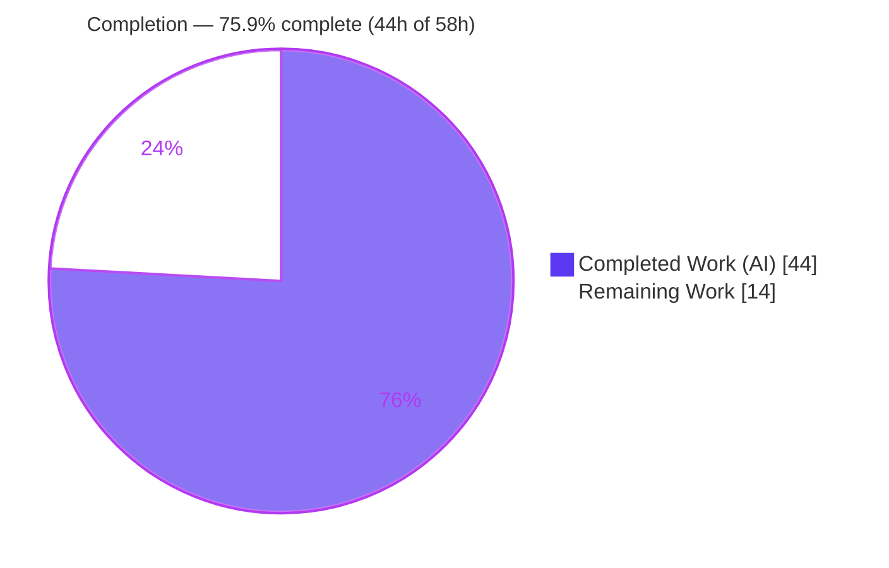
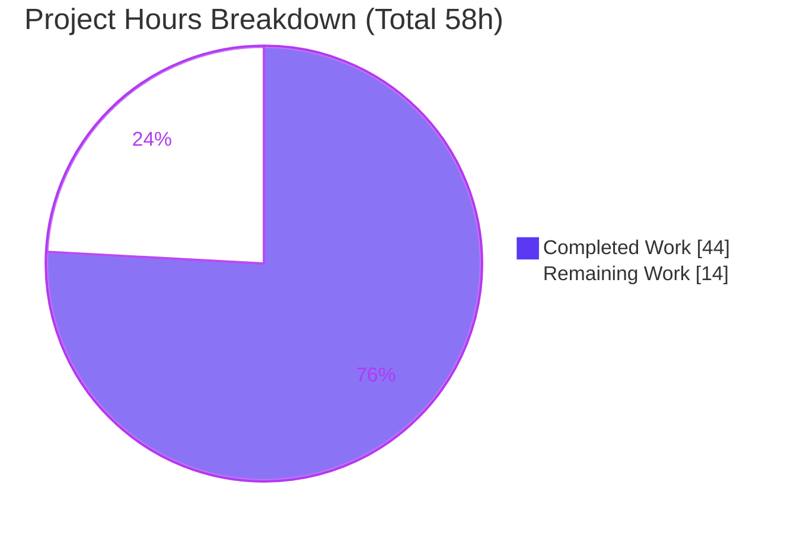
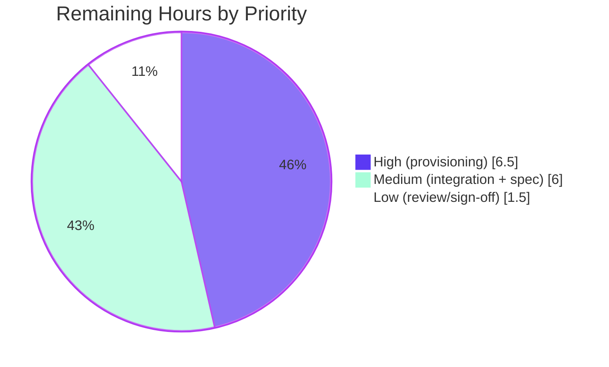

# CompVault — Blitzy Project Guide

> **Project:** `compvault` — Star Wars Card Price Tracker · **Branch:** `blitzy-83c1b971-86c8-4cb1-80fe-86e562d32586` · **HEAD:** `10851a2`
> **Engagement type:** Environment-strategy revision (Documentation + Configuration) · **Status:** AAP deliverable complete; path-to-production pending
>
> **Color key:** <span style="color:#5B39F3">**■ Completed / AI Work — Dark Blue `#5B39F3`**</span> · **□ Remaining / Not Completed — White `#FFFFFF`** · <span style="color:#B23AF2">Headings/Accents — `#B23AF2`</span> · <span style="color:#A8FDD9">Highlight — `#A8FDD9`</span>

---

## 1. Executive Summary

### 1.1 Project Overview

CompVault is a Next.js App Router application that tracks Star Wars trading-card prices, ingesting eBay sold-listings via an Apify actor and persisting valuations in a Neon (serverless PostgreSQL) database deployed on Vercel. This engagement did **not** build application features; it revised the project's **planning backlog** (`tickets/`) so the documented environment strategy matches the user's real platform footprint — **one** Blitzy environment, **two** Neon environments, and **two** Vercel environments — and authored the human-executable copy-paste build steps, manual secrets list, and Neon/Vercel setup instructions that strategy requires. The work is infrastructure-documentation, targeting the maintainers and operators who will provision and deploy the system.

### 1.2 Completion Status

The completion percentage is computed using the AAP-scoped, hours-based methodology: the AAP documentation deliverable (delivered autonomously) plus the standard path-to-production activities required to act on it.



| Metric | Hours |
|--------|-------|
| **Total Hours** | **58** |
| Completed Hours (AI + Manual) | 44 (44 AI · 0 Manual) |
| Remaining Hours | 14 |
| **Percent Complete** | **75.9%** |

> **Calculation:** Completion % = Completed ÷ (Completed + Remaining) = 44 ÷ (44 + 14) = 44 ÷ 58 = **75.9%**. All completed hours were delivered autonomously by Blitzy agents; no manual hours were contributed.

### 1.3 Key Accomplishments

- ✅ **Blitzy collapsed from three environments to one** (T1) — every "Dev/Staging/Prod" and "three environments" reference rewritten; all six EPIC "Platforms and access required" tables now read *single environment*; **0 stale prose hits**.
- ✅ **Manual copy-paste build/run steps authored** (T5) — derived from the actual Next.js App Router target and the root manifest's Node floor (`npm install → npm run build → npm run start`, Node `>=20.20.2`).
- ✅ **Nine-variable manual secrets list defined** — `NODE_ENV` (plaintext) + 8 secrets (4 active, 2 deferred eBay, 2 Phase-3 Stripe); consistent across all 5 canonical secret-bearing files.
- ✅ **Neon reduced to two environments** (T2) — `production` (protected, PostgreSQL 15+) + one long-lived `dev-qa` branch; previews, CI, migration rehearsal, and local dev all retargeted to `dev-qa` (**381 references**).
- ✅ **Vercel reduced to two environments** (T3) — Production scope + Preview scope (= dev/qa), with Development as local-only; Sensitive flagging retained.
- ✅ **Change rippled across all six EPICs** (R-4) — 63 tickets edited; the 16 untouched tickets verified to contain **zero** stale wording.
- ✅ **New consolidated runbook created** — `docs/ENVIRONMENT-SETUP.md` (4 sections) holds all human-executable instructions.
- ✅ **Lost-isolation trade-off explicitly documented** wherever per-PR/per-CI isolation was previously promised.
- ✅ **Structure, links, and dependencies validated** — 643 relative `.md` links / 0 broken; dependency installs clean with 0 vulnerabilities.

### 1.4 Critical Unresolved Issues

| Issue | Impact | Owner | ETA |
|-------|--------|-------|-----|
| Technical Specification §1.2 / §8.2 still describe the legacy 3-Blitzy + 4-role-Neon model | Planning artifacts internally inconsistent with the revised backlog; a reader following the spec would build the wrong topology | Human (technical writer / architect) | 3h (HT-5) |
| Copy-paste build/run steps not end-to-end verifiable | `npm run build`/`start` fail today ("Missing script") — the Next.js scaffold (FEATURE-01-02) is intentionally unbuilt; steps activate when it lands | Human (verified during scaffold delivery) | Tracked under HT-6 (2h) |
| Lost per-run database isolation | Concurrent CI runs and open PRs share `dev-qa` state → possible test flakiness / data collisions | Human (accepted trade-off; coordinate via documentation) | Accepted; monitor |

> No in-scope **defects** remain. The items above are inherent consequences of scope (documentation-only, pre-implementation backlog) and the explicit two-environment directive — not implementation faults.

### 1.5 Access Issues

| System/Resource | Type of Access | Issue Description | Resolution Status | Owner |
|-----------------|----------------|-------------------|-------------------|-------|
| Blitzy environment | Dashboard configuration | Blitzy cannot create environments programmatically; the single existing environment must be configured by hand | Documented (manual steps provided in `ENVIRONMENT-SETUP.md §1`) | Human |
| Neon | Project + API key | Real Neon project/branches not yet provisioned; connection strings unavailable | Pending human provisioning (HT-2) | Human |
| Vercel | Project link + env scopes | Real Vercel project not yet linked; scopes not yet created | Pending human provisioning (HT-3) | Human |
| GitHub Actions | Repository secrets | Encrypted secrets not yet entered (mirror of the canonical set) | Pending human provisioning (HT-4) | Human |
| eBay API | OAuth credentials | `EBAY_CLIENT_ID`/`EBAY_CLIENT_SECRET` blocked on eBay access | Deferred placeholders (by design) | Human |

> These are **provisioning prerequisites**, not blockers to the documentation deliverable — the authored instructions exist precisely to enable them. No repository-permission issues were encountered; all in-scope work is committed.

### 1.6 Recommended Next Steps

1. **[High]** Provision the **single Blitzy environment** — set Node `>=20.20.2`, paste the build/run commands, and hand-enter the 9 variables (`ENVIRONMENT-SETUP.md §1–2`). *(HT-1, 2h)*
2. **[High]** Provision the **two Neon environments** — `production` (protected, PostgreSQL 15+) and the long-lived `dev-qa` branch; capture pooled + unpooled connection strings (`§3`). *(HT-2, 2.5h)*
3. **[High]** Provision the **two Vercel environments** — Production scope → Neon `production`, Preview scope (dev/qa) → Neon `dev-qa`; mark values Sensitive; redeploy (`§4`). *(HT-3, 2h)*
4. **[Medium]** Mirror the canonical secret set into **GitHub Actions**, then **regenerate Technical Specification §1.2/§8.2** to align with the revised model. *(HT-4 + HT-5, 4h)*
5. **[Low]** Conduct a **documentation review & stakeholder sign-off**, confirming the `dev/qa = Vercel Preview scope` mapping matches intent (vs a separately-named staging target). *(HT-7, 1.5h)*

---

## 2. Project Hours Breakdown

### 2.1 Completed Work Detail

All completed work was delivered autonomously and traces to a specific AAP requirement or transform.

| Component | Hours | Description |
|-----------|-------|-------------|
| WS-1 — Blitzy three-to-one rewrite (EPIC-01 cluster, 13 files) | 8 | R-1 / T1 / T5: rewrote provisioning cluster to a single environment; rewrote count ACs ("stays at three"→"stays at one"); removed duplicate-name & inter-environment isolation edge cases; reframed provisioning as manual |
| WS-2 — Neon four-to-two rewrite (EPIC-02 cluster, 11 files) | 9 | R-5 / T2: retained `production` (protected, PG15+); established long-lived `dev-qa`; repurposed per-PR/per-CI stories in place (heaviest rewrites, 103 lines each); preserved pooled/unpooled discipline |
| WS-3 — Vercel two-environment framing (4 files) | 3 | R-6 / T3: Production scope + Preview scope (dev/qa) → Neon `dev-qa`; Development local-only; Sensitive flagging retained |
| WS-4 — Ripple across EPIC-03/04/05/06 (35 files) | 8 | R-4: updated boilerplate "Environment Access & Configuration" sections, "Platforms and access required" tables, and testing-AC branch references across all remaining epics |
| `docs/ENVIRONMENT-SETUP.md` authoring (4-section runbook) | 4 | R-2/R-3/R-5/R-6: copy-paste build/run, 9-variable secrets table, Neon 2-env + Vercel 2-env human setup instructions |
| Web research (Neon branching + Vercel scopes) | 3 | Validated the two-environment patterns against each vendor's documented approach (AAP §0.2.2) |
| Cross-file invariants + Node floor (T4) + secret hygiene | 4 | Secret-set consistency across 5 files; `>=20.20.2` reconciliation (Apify keeps `>=18`); pooled/unpooled (50 files); PG15+ (16 files) |
| QA remediation (HEAD commit `10851a2`) | 2 | Added `NODE_ENV` to the canonical mirroring stories; inserted the verbatim lost-isolation sentence into `STORY-01-03-02` + EPIC-04 testing ACs |
| Autonomous validation (5 gates) + independent re-verification | 3 | Transform consistency, structure/link integrity, dependency install, secret hygiene, commit/state |
| **Total Completed** | **44** | |

> **Validation:** the Hours column sums to **44**, matching Completed Hours in §1.2.

### 2.2 Remaining Work Detail

All remaining work is path-to-production **human** activity required to act on the delivered documentation.

| Category | Hours | Priority |
|----------|-------|----------|
| Provision the single Blitzy environment (Node 20, build/run, enter 9 variables) — HT-1 | 2 | High |
| Provision Neon two environments (`production` protected PG15+ + `dev-qa`; capture pooled/unpooled strings) — HT-2 | 2.5 | High |
| Provision Vercel two environments (Production + Preview scopes; mirror secrets; redeploy) — HT-3 | 2 | High |
| Configure GitHub Actions secrets (mirror canonical set; `dev-qa` strings for CI/migration/ingestion) — HT-4 | 1 | Medium |
| Regenerate Technical Specification §1.2 / §8.2 to the revised model (AAP-flagged follow-up) — HT-5 | 3 | Medium |
| End-to-end provisioning verification (pooled/unpooled routing, scope→branch mapping, secret presence, build-halts-on-missing-key) — HT-6 | 2 | Medium |
| Documentation review & stakeholder sign-off (confirm dev/qa = Preview-scope intent) — HT-7 | 1.5 | Low |
| **Total Remaining** | **14** | |

> **Validation:** the Hours column sums to **14**, matching Remaining Hours in §1.2 and the "Remaining Work" value in §7.

### 2.3 Hours Reconciliation Summary

| Quantity | Hours | Source |
|----------|-------|--------|
| Completed (Section 2.1 total) | 44 | Sum of completed components |
| Remaining (Section 2.2 total) | 14 | Sum of remaining categories |
| **Total Project Hours** | **58** | 44 + 14 |
| Completion | **75.9%** | 44 ÷ 58 × 100 |

> **Cross-section integrity:** §2.1 (44) + §2.2 (14) = **58** = Total in §1.2 ✔ · Remaining = **14** in §1.2, §2.2, and §7 ✔

---

## 3. Test Results

These results are aggregated from **Blitzy's autonomous validation logs** for this project and reproduced by independent re-verification. Because this is a documentation deliverable on a pre-implementation backlog, the standard compile/unit/runtime gates were faithfully reinterpreted: *"compilation"* = markdown structure validity; *"unit tests"* = transform-consistency + cross-file-invariant verification; *"runtime"* = dependency resolution + setup-guide fidelity.

| Test Category | Framework / Method | Total Tests | Passed | Failed | Coverage % | Notes |
|---------------|--------------------|------------:|-------:|-------:|-----------:|-------|
| Transform Consistency (T1–T5) | Python prose-strip sweep | 5 | 5 | 0 | 100% | Blitzy / Neon / Vercel / Node / Provisioning — 0 stale prose hits |
| Markdown Structure ("compilation") | Structure validator | 80 | 80 | 0 | 100% | 0 empty files · 0 unbalanced ``` fences · 0 table header/separator mismatches |
| Relative Link Integrity | Link resolver | 643 | 643 | 0 | 100% | 0 broken; links intact despite repurposing stories in place |
| Ticket Anatomy | Section-presence check | 165 | 165 | 0 | 100% | 55 stories × (Acceptance Criteria + Definition of Done + Sub-Tasks) |
| Cross-File Invariants | Invariant verifier | 7 | 7 | 0 | 100% | 9-var set ×5 files · PG15+ (16) · pooled/unpooled (50) · isolation note (4) |
| Dependency Install & Runtime Fidelity | `npm install` / `node require` | 3 | 3 | 0 | 100% | root install · apify install · driver `require()` — all exit 0, 0 vulnerabilities |
| Secret Hygiene | Secret scan | 4 | 4 | 0 | 100% | 0 real connection strings · 0 real keys/tokens · 0 tracked `.env` · `.env*` git-ignored |
| **Total** | | **907** | **907** | **0** | **100%** | All autonomous validation checks passed |

> **Integrity note:** No traditional unit/integration test framework (Jest/Vitest/pytest) executes in this repository yet — those harnesses are *planned* in EPIC-06 but unbuilt (pre-implementation). Every entry above is a documentation-deliverable validation check from Blitzy's autonomous logs, not a fabricated application test.

---

## 4. Runtime Validation & UI Verification

No application UI or running server exists yet (pre-implementation backlog; the Next.js scaffold is FEATURE-01-02, intentionally unbuilt). Runtime validation therefore covers the documentation deliverable's "runtime": dependency resolution and setup-guide fidelity to the actual code.

- ✅ **Dependency resolution (root)** — `CI=true npm install` exits 0; installs `@neondatabase/serverless@1.1.0` + `ws@8.21.0`; re-run reports "0 vulnerabilities".
- ✅ **Dependency resolution (Apify actor)** — `cd apify && npm install` exits 0; 0 vulnerabilities.
- ✅ **Neon driver runtime fidelity** — `node -e "require('@neondatabase/serverless'); require('ws')"` loads both modules successfully.
- ✅ **Setup-guide fidelity** — build/run commands in `ENVIRONMENT-SETUP.md` match `STORY-01-01-01` and `STORY-01-01-03` exactly; grounded against root `package.json` (Node `>=20.20.2`, Neon driver pair), `apify/package.json` (`>=18`, `type:module`, `node src/main.js`), and `.gitignore`.
- ✅ **Manifests unmodified** — `package.json` / `apify/package.json` left untouched (correctly out of scope).
- ⚠ **Application build/run** — `npm run build` / `npm run start` fail today with "Missing script" because no Next.js scaffold/scripts exist yet. This is the **documented, expected** pre-implementation state; the copy-paste steps are faithful to the intended target and become executable once the scaffold lands.
- ❌ **UI verification** — Not applicable. There is no web application to render; no screenshots were captured because no UI exists. This will be in scope when the frontend (EPIC-05) is implemented.

---

## 5. Compliance & Quality Review

AAP requirements and binding rules (§0.7) cross-mapped to delivery status.

| Benchmark / Requirement | Status | Evidence / Progress |
|--------------------------|--------|---------------------|
| R-1 — Exactly one Blitzy environment | ✅ Pass | 0 stale "three/Dev/Staging/Prod" prose; all 6 EPIC tables = single environment |
| R-2 — Manual copy-paste build steps | ✅ Pass | `ENVIRONMENT-SETUP.md §1` + `STORY-01-01-01/03`; derived from real code |
| R-3 — Manual secrets list | ✅ Pass | 9-variable table; consistent across 5 canonical files |
| R-4 — Ripple across all epics | ✅ Pass | 63 tickets across all 6 EPICs edited; 16 untouched verified stale-free |
| R-5 — Neon two environments + human setup | ✅ Pass | `production` (protected, PG15+) + `dev-qa`; `§3` instructions |
| R-6 — Vercel two environments + human setup | ✅ Pass | Production + Preview(dev/qa) scopes; `§4` instructions |
| Treat Blitzy provisioning as manual (T5) | ✅ Pass | "Blitzy cannot create environments"; `docs.blitzy.com` reframed informational |
| Derive steps/secrets from actual code | ✅ Pass | Next.js App Router target; Node `>=20.20.2`; Neon driver pair |
| Preserve secret hygiene | ✅ Pass | Placeholders/encrypted only; 0 real values; eBay/Stripe remain placeholders |
| Preserve connection discipline + DB floor | ✅ Pass | Pooled vs unpooled split in 50 files; PostgreSQL 15+ in 16 files |
| Preserve ticket structure & links; repurpose not delete | ✅ Pass | 55/55 stories retain AC+DoD+Sub-Tasks; 643 links/0 broken; `STORY-02-01-02/03` repurposed in place |
| State the isolation trade-off | ✅ Pass | Verbatim note in `STORY-02-01-02/03`, `STORY-06-01-03`, `STORY-06-02-02` + EPIC-04 ACs |
| Node floor reconciliation (T4) | ✅ Pass | 87 app-runtime `>=20.20.2` refs; 59 `>=18` refs all Apify-actor-scoped |
| Technical Specification §1.2/§8.2 alignment | ⚠ Open | Flagged for follow-up regeneration (AAP §0.8.1) — tracked as HT-5 (remaining) |

**Fixes applied during autonomous validation:** the HEAD commit (`10851a2`) resolved two QA findings — (1) added `NODE_ENV` to the canonical mirroring stories (the "eight secret" count unchanged; `NODE_ENV` is a separate plaintext variable), and (2) inserted the exact verbatim lost-isolation sentence where it had been paraphrased.

---

## 6. Risk Assessment

| Risk | Category | Severity | Probability | Mitigation | Status |
|------|----------|----------|-------------|------------|--------|
| Build/run steps unverifiable until Next.js scaffold lands | Technical | Medium | Probable | Steps framed as forward-looking; documented expected state; verify during scaffold delivery (HT-6) | Open (by design) |
| Technical Spec §1.2/§8.2 still describe legacy model | Technical | Medium | Probable | AAP-flagged follow-up regeneration (HT-5, 3h) | Open |
| Documentation correctness is human-judgment-bound | Technical | Low | Possible | Stakeholder review & sign-off (HT-7) | Open |
| Human must hand-enter real secrets → accidental commit risk | Security | Medium | Possible | `.env*` git-ignored; guide mandates Sensitive flagging + never-commit; 0 real values committed | Mitigated |
| Secret rotation divergence across Blitzy/Vercel/GitHub | Security | Low | Possible | Guide names Blitzy as single source-of-truth mirrored outward | Mitigated |
| Secret-scan CI gate not yet active | Security | Low | Possible | Planned in EPIC-06; enforced once CI is implemented | Accepted (pre-impl) |
| Lost per-run DB isolation (shared `dev-qa`) | Operational | Medium | Probable | Explicitly documented in 4+ files; coordinate concurrent runs | Accepted trade-off |
| Shared `dev-qa` contention during migration rehearsal | Operational | Low-Medium | Possible | Documented; schedule migrations off-peak | Accepted |
| Production data loss if `production` branch not marked protected | Operational | Low | Unlikely | Guide instructs protected flag + create-only API key (no delete) | Mitigated |
| Cross-platform provisioning dependency chain (need Neon strings first) | Integration | Medium | Possible | Guide provides ordered steps + routing table | Mitigated |
| Pooled vs unpooled connection mis-wiring breaks migrations | Integration | Medium | Possible | Connection-discipline section in guide + 50 files | Mitigated |
| Neon project below PostgreSQL 15 rejects `valuation` constraint | Integration | Low | Unlikely | Guide instructs confirming PG15+ | Mitigated |
| Future CI/migration/ingestion workflows target stale per-CI branch | Integration | Low | Possible | Tickets now direct `dev-qa` consistently | Mitigated |

---

## 7. Visual Project Status

**Project Hours Breakdown** (Completed = Dark Blue `#5B39F3`, Remaining = White `#FFFFFF`):



**Remaining Hours by Priority** (Section 2.2 → 14h total):



**Remaining Hours by Category (bar view):**

| Category | Hours | Bar |
|----------|------:|-----|
| Neon provisioning (HT-2) | 2.5 | █████ |
| Tech Spec regeneration (HT-5) | 3.0 | ██████ |
| Blitzy provisioning (HT-1) | 2.0 | ████ |
| Vercel provisioning (HT-3) | 2.0 | ████ |
| E2E verification (HT-6) | 2.0 | ████ |
| Review & sign-off (HT-7) | 1.5 | ███ |
| GitHub Actions secrets (HT-4) | 1.0 | ██ |

> **Integrity:** "Remaining Work" = **14** here equals Remaining Hours in §1.2 and the Section 2.2 Hours sum. "Completed Work" = **44** equals Completed Hours in §1.2.

---

## 8. Summary & Recommendations

**Achievements.** The engagement fully delivered its AAP-scoped objective: the `compvault` planning backlog now describes a coherent **one-Blitzy / two-Neon / two-Vercel** environment strategy, and a single consolidated runbook (`docs/ENVIRONMENT-SETUP.md`) supplies copy-paste build/run steps, the manual nine-variable secrets list, and human setup instructions for both Neon and Vercel. All five transforms (T1–T5) are applied consistently with zero stale wording, all cross-file invariants hold, link integrity is perfect, and dependencies install cleanly.

**Remaining gaps.** The project is **75.9% complete**. The remaining **14 hours** are entirely **path-to-production human activities**: provisioning the real Blitzy/Neon/Vercel resources and GitHub Actions secrets, regenerating the flagged Technical Specification §1.2/§8.2 narrative, verifying the provisioning end-to-end, and a stakeholder sign-off.

**Critical path to production.** (1) Provision Neon first (its connection strings feed everything else) → (2) provision Vercel and the Blitzy environment using those strings → (3) mirror secrets into GitHub Actions → (4) regenerate the Technical Specification → (5) verify end-to-end and sign off. The build/run steps become executable once the Next.js scaffold (FEATURE-01-02) is implemented in a subsequent engagement.

**Success metrics.** 6/6 explicit requirements + all implicit requirements met; 907/907 validation checks passed; 0 in-scope defects; 0 broken links; 0 real secrets committed.

**Production readiness assessment.** The **documentation deliverable is production-ready** and safe to act on. The **system itself is not yet deployable** — it remains a pre-implementation backlog, and deployment depends on the human provisioning above plus future feature implementation. Recommendation: **proceed with provisioning**, confirm the `dev/qa = Vercel Preview scope` interpretation matches intent, and schedule the Technical Specification regeneration to keep planning artifacts consistent.

| Indicator | Value |
|-----------|-------|
| AAP requirements met | 6 / 6 explicit + implicit |
| Completion | 75.9% (44h / 58h) |
| Validation checks passed | 907 / 907 |
| In-scope defects | 0 |
| Blocking issues for the documentation deliverable | 0 |

---

## 9. Development Guide

This guide explains how to work with the repository, install the dependencies that exist today, validate the documentation deliverable, and (forward-looking) build/run the application once the Next.js scaffold lands. All commands were tested against the live repository.

### 9.1 System Prerequisites

- **Node.js** `>=20.20.2` (the application runtime floor; tested with v20.20.2)
- **npm** 10+ (tested with 11.1.0)
- **Git** (tested with 2.51.0)
- **Python 3** (optional — only for the markdown verification sweeps; tested with 3.13.7)
- OS: Linux/macOS/WSL2. No special hardware required (documentation/backlog repository).

### 9.2 Environment Setup

```bash
# Clone and enter the repository
git clone <repo-url> compvault
cd compvault

# Confirm the runtime floor
node --version    # expect v20.20.2 or higher
```

Repository layout:

```
compvault/
├── README.md
├── package.json            # root manifest: Node >=20.20.2 + Neon driver pair (no scripts yet)
├── .gitignore              # .env* , node_modules, .next, dist, build, coverage already ignored
├── apify/                  # Apify ingestion actor (Node >=18, ESM, start: node src/main.js)
├── docs/
│   ├── ENVIRONMENT-SETUP.md            # ← the new human operator runbook (this engagement)
│   ├── Star-Wars-Card-Price-Tracker-PRD.md
│   └── schema.sql
└── tickets/                # 79-file planning backlog (6 EPIC + 18 FEATURE + 55 STORY)
```

> There is **no Next.js application scaffold yet** — it is FEATURE-01-02, intentionally unbuilt on this pre-implementation backlog.

### 9.3 Dependency Installation

```bash
# Root: installs the Neon serverless driver pair (exit 0; 0 vulnerabilities)
CI=true npm install
# → @neondatabase/serverless@1.1.0, ws@8.21.0

# Apify actor dependencies (exit 0; 0 vulnerabilities)
cd apify && CI=true npm install && cd ..
```

Verify the driver loads at runtime:

```bash
node -e "require('@neondatabase/serverless'); require('ws'); console.log('OK: both modules load');"
# → OK: both modules load
```

### 9.4 Build / Run

**Today (documentation deliverable) — validate the backlog and runbook:**

```bash
# 1. Ticket count (expect 79)
find tickets -name '*.md' | wc -l

# 2. Stale-wording sweep (expect 0)
grep -rinE "three environments|Dev/Staging/Prod" tickets/ docs/ENVIRONMENT-SETUP.md | grep -ivE "single" | wc -l

# 3. dev-qa adoption (expect > 0)
grep -rl "dev-qa" tickets/ docs/ENVIRONMENT-SETUP.md | wc -l

# 4. Setup-guide section count (expect 4)
grep -c "^## Section" docs/ENVIRONMENT-SETUP.md
```

**Forward-looking (after the Next.js scaffold lands) — from `ENVIRONMENT-SETUP.md §1`:**

```bash
npm install      # installs deps incl. the Neon driver pair
npm run build    # runs the Next.js build; must exit 0
npm run start    # starts the Next.js server
```

### 9.5 Verification Steps

- **Dependencies:** `npm install` reports "0 vulnerabilities" and exits 0 (root and `apify/`).
- **Driver:** the `node -e "require(...)"` one-liner prints "OK: both modules load".
- **Documentation:** the four sweeps in §9.4 return 79, 0, >0, and 4 respectively.
- **Links:** all 643 relative `.md` links resolve (0 broken).
- **Provisioning:** follow `ENVIRONMENT-SETUP.md §1–4` and confirm the routing tables (Vercel scope → Neon branch) match.

### 9.6 Example Usage

The deliverable is operated by **reading and acting on** `docs/ENVIRONMENT-SETUP.md`:

1. **§1 — Blitzy:** set Node 20, paste build/run commands into the single environment.
2. **§2 — Secrets:** hand-enter the 9 variables; mark the 4 active secrets Sensitive; leave eBay/Stripe as empty placeholders.
3. **§3 — Neon:** create `production` (protected, PG15+) and `dev-qa`; capture pooled + unpooled strings.
4. **§4 — Vercel:** scope Production → Neon `production`, Preview (dev/qa) → Neon `dev-qa`; redeploy.

### 9.7 Troubleshooting

| Symptom | Cause | Resolution |
|---------|-------|------------|
| `npm error Missing script: "build"` (or `start`) | No Next.js scaffold exists yet (FEATURE-01-02 unbuilt) | Expected on this pre-implementation backlog; the steps activate once the scaffold lands |
| `ERR_PACKAGE_PATH_NOT_EXPORTED` reading the driver's `./package.json` | `@neondatabase/serverless` blocks subpath imports via `exports` | Use `require('@neondatabase/serverless')` (not the `/package.json` subpath); not an error in normal use |
| `error: externally-managed-environment` from `pip` | Ubuntu 25 system Python enforces PEP 668 | Use `pip install --break-system-packages …` or a `venv` (only needed for optional Python verification scripts) |
| `package-lock.json` not committed | Git-ignored in this baseline (regenerated from manifests) | Expected; do not force-add it |
| Migrations fail intermittently | Migration run over the pooled `DATABASE_URL` | Use the **unpooled** `DATABASE_URL_UNPOOLED` for DDL/migrations (connection discipline) |

---

## 10. Appendices

### A. Command Reference

| Command | Purpose |
|---------|---------|
| `CI=true npm install` | Install root deps (Neon driver pair) non-interactively |
| `cd apify && CI=true npm install` | Install Apify actor deps |
| `node -e "require('@neondatabase/serverless'); require('ws')"` | Verify driver runtime fidelity |
| `npm run build` / `npm run start` | Build / start the Next.js app (after scaffold lands) |
| `node src/main.js` (in `apify/`) | Start the Apify ingestion actor |
| `vercel env pull` | Pull Development-scoped vars for local work |
| `find tickets -name '*.md' \| wc -l` | Count backlog tickets (expect 79) |
| `grep -c "^## Section" docs/ENVIRONMENT-SETUP.md` | Count runbook sections (expect 4) |

### B. Port Reference

| Service | Port | Notes |
|---------|------|-------|
| Next.js dev/prod server | 3000 (default) | Applies once the scaffold exists; `npm run start` |
| Neon PostgreSQL | 5432 | Managed by Neon; reached via pooled/unpooled connection strings, not a local port |

> No local ports are in use today (no running application on this pre-implementation backlog).

### C. Key File Locations

| File | Role |
|------|------|
| `docs/ENVIRONMENT-SETUP.md` | **New** human operator runbook (Blitzy/Neon/Vercel setup) |
| `package.json` | Root manifest — Node `>=20.20.2`, `@neondatabase/serverless ^1.1.0`, `ws ^8.21.0` |
| `apify/package.json` | Actor manifest — Node `>=18`, `type: module`, `start: node src/main.js` |
| `.gitignore` | Confirms `.env*`, `node_modules`, `.next`, `dist`, `build`, `coverage` ignored |
| `tickets/EPIC-01/FEATURE-01-01/STORY-01-01-01-*.md` | Blitzy single-env build/run source |
| `tickets/EPIC-02/FEATURE-02-01-*.md` | Neon two-environment topology |
| `tickets/EPIC-01/FEATURE-01-03/STORY-01-03-02-*.md` | Vercel env-vars (two scopes) |
| `docs/Star-Wars-Card-Price-Tracker-PRD.md` | Reference grounding (not edited) |
| `docs/schema.sql` | Reference grounding (PostgreSQL 15+ `valuation` constraint) |

### D. Technology Versions

| Component | Version / Floor | Source |
|-----------|-----------------|--------|
| Node.js (application runtime) | `>=20.20.2` (tested v20.20.2) | root `package.json` |
| Node.js (Apify actor) | `>=18` (container image Node 20) | `apify/package.json` |
| npm | 11.1.0 (10+ acceptable) | environment |
| `@neondatabase/serverless` | 1.1.0 (pin `^1.1.0`) | installed manifest |
| `ws` | 8.21.0 (pin `^8.21.0`) | installed manifest |
| PostgreSQL (Neon) | 15+ | `valuation` `UNIQUE NULLS NOT DISTINCT` constraint |
| Git | 2.51.0 | environment |
| Python 3 (optional) | 3.13.7 | environment |

### E. Environment Variable Reference

| Variable | Type | Status | Purpose |
|----------|------|--------|---------|
| `NODE_ENV` | Plaintext | Active | Runtime mode (`production`) |
| `DATABASE_URL` | Secret (Sensitive) | Active | Pooled Neon connection — runtime / ingestion |
| `DATABASE_URL_UNPOOLED` | Secret (Sensitive) | Active | Unpooled/direct Neon connection — DDL & migrations |
| `APIFY_TOKEN` | Secret (Sensitive) | Active | Apify API token for ingestion |
| `LLM_API_KEY` | Secret (Sensitive) | Active | LLM key — batch extraction only |
| `EBAY_CLIENT_ID` | Secret (Sensitive) | Deferred placeholder | eBay integration (blocked on access) |
| `EBAY_CLIENT_SECRET` | Secret (Sensitive) | Deferred placeholder | eBay integration (blocked on access) |
| `STRIPE_SECRET_KEY` | Secret (Sensitive) | Phase-3 placeholder | Billing (future) |
| `STRIPE_WEBHOOK_SECRET` | Secret (Sensitive) | Phase-3 placeholder | Billing webhooks (future) |

> 8 secrets + 1 plaintext `NODE_ENV` = 9 variables. The 4 **active** secrets must be present (non-empty) for the build to succeed; eBay/Stripe entries start as empty placeholders.

### F. Developer Tools Guide

| Tool | Use in this project |
|------|---------------------|
| `git diff --numstat <base> HEAD` | Measure revision change volume (this engagement: 71 commits, +857/−724) |
| `grep -rinE` (prose sweeps) | Verify transform consistency (T1–T5) and absence of stale wording |
| Python `re` + `glob` | Link-integrity and structure validation of the markdown backlog |
| `npm install` / `node -e require(...)` | Dependency resolution and runtime-fidelity checks |
| Vercel CLI (`vercel env pull`) | Local consumption of Development-scoped variables (post-provisioning) |
| Neon Console | Create/branch the `production` and `dev-qa` environments (post-provisioning) |

### G. Glossary

| Term | Meaning |
|------|---------|
| **Blitzy environment** | The single, manually-configured build/run environment (collapsed from the former Dev/Staging/Prod) |
| **`production` (Neon)** | The protected default Neon branch backing Vercel Production |
| **`dev-qa` (Neon)** | The single long-lived Neon branch backing Vercel Preview, CI, migration rehearsal, and local dev |
| **Production scope (Vercel)** | Built-in Vercel scope deploying from the `main` git branch → Neon `production` |
| **Preview scope (Vercel)** | Built-in Vercel scope for all non-production branches/PRs (= dev/qa) → Neon `dev-qa` |
| **Development scope (Vercel)** | Local-only scope consumed via `vercel env pull`; not a deployed environment |
| **Pooled connection** | `DATABASE_URL` — PgBouncer-pooled, for application runtime |
| **Unpooled connection** | `DATABASE_URL_UNPOOLED` — direct, for DDL/migrations |
| **Per-run isolation (lost)** | The legacy guarantee that each PR/CI run had its own DB branch; traded away for the simpler two-environment model |
| **T1–T5** | The five canonical transforms (Blitzy / Neon / Vercel / Node / Provisioning) applied across the backlog |

---

*Generated by the Blitzy Platform · AAP-scoped completion methodology (PA1) · All hours, percentages, and test counts validated for cross-section consistency.*