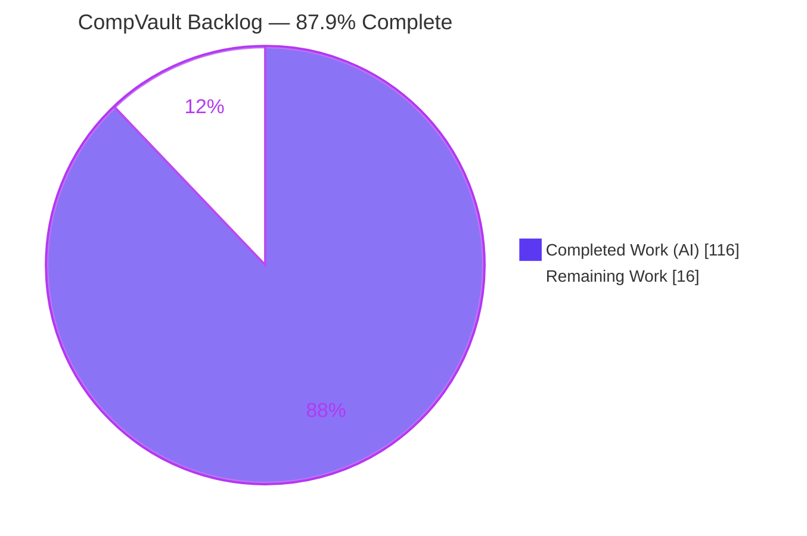
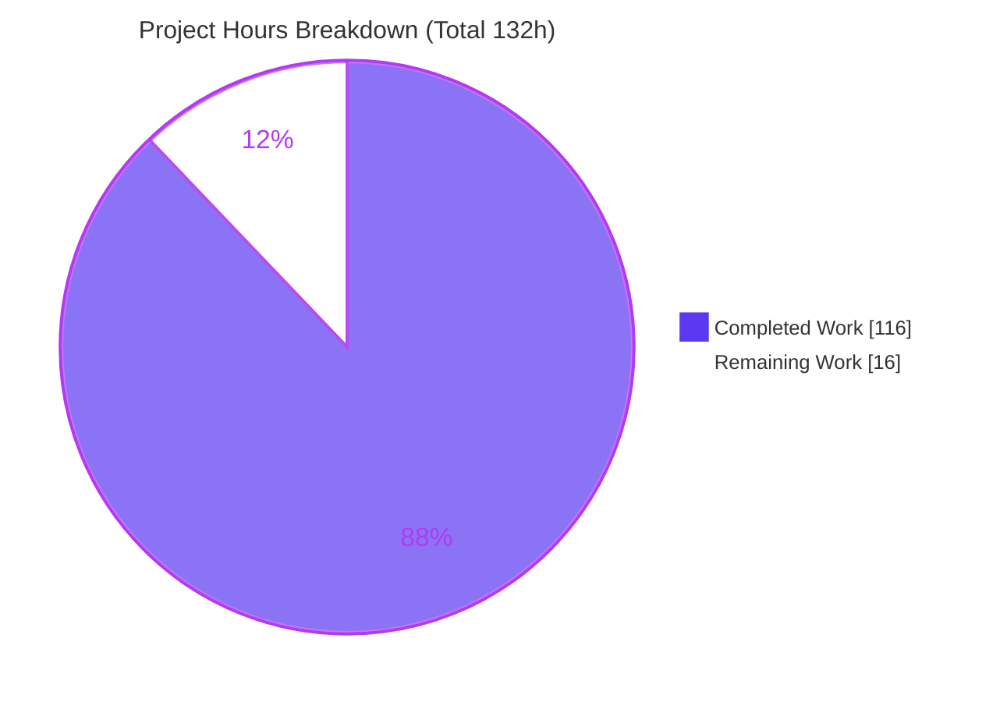
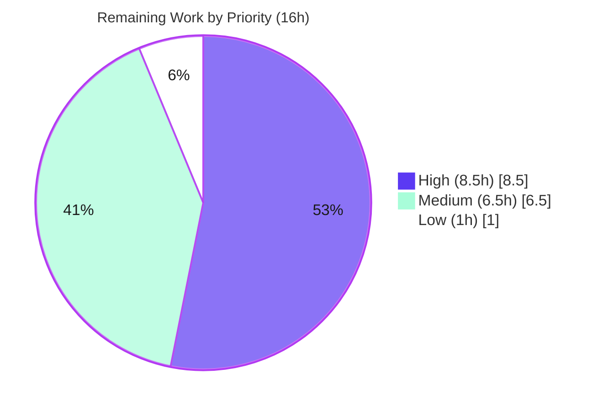

# Blitzy Project Guide — CompVault Agile Backlog

> **Deliverable type:** Documentation / planning artifact (INVEST-compliant Agile backlog)
> **Branch:** `blitzy-3dd4b9bf-1667-4b9e-b190-b33862bd4900` · **HEAD:** `1bc18d8` · **Author:** `agent@blitzy.com`
> **Brand legend:** <span style="color:#5B39F3">**■ Completed / AI Work (Dark Blue #5B39F3)**</span> · ■ Remaining / Not Completed (White #FFFFFF) · Accent #B23AF2 · Highlight #A8FDD9

---

## 1. Executive Summary

### 1.1 Project Overview

CompVault is a greenfield Star Wars trading-card price-intelligence application. This task's objective was to decompose its Phase 0 + Phase 1 MVP build into a complete, INVEST-compliant Agile backlog of EPIC → FEATURE → STORY markdown tickets under `tickets/`. The target consumers are the downstream engineering team and product stakeholders who will execute the plan across six domains: environment foundation, the Neon database, Apify-primary data ingestion, the backend API, the frontend UI, and testing/CI-CD. The business impact is a navigable, machine-parseable, requirements-engineered roadmap with quantified acceptance criteria and per-epic environment runbooks. The technical scope of *this* task is documentation only — no application source code is built or run.

### 1.2 Completion Status

**AAP-scoped completion: 87.9% (116 of 132 hours).** The autonomous authoring deliverable — all 79 backlog files — is 100% complete and independently validated. The remaining 16 hours are human path-to-production activities (review/sign-off, tracker import, refinement) plus two explicit open items.



| Metric | Hours |
|--------|-------|
| **Total Hours** | **132** |
| Completed Hours (AI) | 116 |
| Completed Hours (Manual) | 0 |
| **Completed Hours (AI + Manual)** | **116** |
| **Remaining Hours** | **16** |
| **Percent Complete** | **87.9%** |

> Calculation (PA1, AAP-scoped): `Completion % = Completed ÷ (Completed + Remaining) × 100 = 116 ÷ 132 × 100 = 87.9%`.

### 1.3 Key Accomplishments

- ✅ Authored the full backlog tree: **6 EPIC + 18 FEATURE + 55 STORY = 79 markdown files** (~5,893 lines), matching the AAP §0.4.1 authoritative enumeration exactly (0 missing, 0 extra).
- ✅ Embedded a per-epic **Environment Access & Configuration** section in every epic, all citing `https://docs.blitzy.com/administration/environments` (6/6 epics; 59/79 files).
- ✅ Encoded all **five binding user constraints**: Neon branching-first, pooled `DATABASE_URL` vs unpooled `DATABASE_URL_UNPOOLED`, the local-Neon "may or may not be enough" uncertainty, Apify-primary ingestion, and the deferred/blocked eBay API.
- ✅ Met the methodology bar: INVEST stories, 4–8 Given/When/Then BDD acceptance criteria per story, **zero prohibited vague terms**, deterministic zero-padded naming, edge cases, `@assignee` sub-tasks, Fibonacci estimation, and Definitions of Done across all 55 stories.
- ✅ Grounded content in canonical references (`docs/schema.sql`, the PRD, the Apify actor) — including correctly citing the real `valuation` table rather than the AAP prose's nonexistent `valuation_cache`.
- ✅ Passed all autonomous validation gates (structural, content, links) at **100% (79/79)**; the single genuine defect found (an AC category-label omission) was fixed in commit `1bc18d8`.

### 1.4 Critical Unresolved Issues

| Issue | Impact | Owner | ETA |
|-------|--------|-------|-----|
| AAP prose cites "57 stories / 81 files" while the authoritative §0.4.1 list (and repo) contain 55 / 79 | Low — a reader trusting the prose may believe 2 tickets are missing; the §0.4.1 enumeration is complete and validated | Product Owner / Tech Lead | 1.5h |
| Local Neon setup "may or may not be enough" for local + test access is unverified | Medium — local-dev/test onboarding could stall if the existing connection is insufficient; explicitly surfaced in `STORY-02-01-04` | Database Engineer | 1.5h |
| eBay API integration blocked on approved developer access | Medium — second ingestion source unavailable until approval; MVP unblocked because Apify is primary | Product Owner | 1h (initiate) |

> No issue blocks the documentation deliverable itself; all are downstream path-to-production items already surfaced as tracked tickets/notes.

### 1.5 Access Issues

| System/Resource | Type of Access | Issue Description | Resolution Status | Owner |
|-----------------|----------------|-------------------|-------------------|-------|
| eBay Developer API | `EBAY_CLIENT_ID` / `EBAY_CLIENT_SECRET` | Approved developer access not yet obtained; integration deferred by user instruction | Deferred by design — tracked in `STORY-03-03-03`; not a dependency of any active story | Product Owner |
| Neon (local) | Local connection string | Existing local Neon setup may be insufficient for local + test access (user-flagged uncertainty) | Open verification item — surfaced in `STORY-02-01-04` | Database Engineer |
| Blitzy / Neon / Vercel / GitHub Actions / Apify | Project provisioning + credentials | Platforms documented per-epic but not yet provisioned (required only when *executing* the backlog) | Not blocking this task; provisioning is the first step of backlog execution | DevOps / Platform Eng. |

> The documentation deliverable required **no** privileged access to produce and has none outstanding. The rows above are forward-looking access items for backlog *execution*.

### 1.6 Recommended Next Steps

1. **[High]** Conduct a stakeholder review and subject-matter sign-off of all 79 tickets for architectural correctness and completeness *(7h)*.
2. **[High]** Reconcile the AAP prose story-count discrepancy — confirm 55 stories is the complete set, or author 2 additional stories if a genuine gap is identified *(1.5h)*.
3. **[Medium]** Resolve the local-Neon verification flagged in `STORY-02-01-04` by testing the existing connection against the migration + integration suite *(1.5h)*.
4. **[Medium]** Import the backlog into the team's issue tracker (Jira / Linear / GitHub Issues), preserving the EPIC→FEATURE→STORY hierarchy and dependency links *(3h)*.
5. **[Low]** Confirm the eBay deferral with stakeholders and initiate the developer access-request process *(1h)*.

---

## 2. Project Hours Breakdown

### 2.1 Completed Work Detail

| Component | Hours | Description |
|-----------|-------|-------------|
| EPIC-01 — Environment & Configuration Foundation (13 files) | 13 | Epic + 3 features + 9 stories: Blitzy environments, Next.js+TypeScript scaffold, `.env.example`, Vercel/GitHub secrets |
| EPIC-02 — Database Platform & Schema (14 files) | 18 | Epic + 3 features + 10 stories: Neon branching topology (hard prerequisite), Drizzle schema mirroring `schema.sql`, pooled access layer, seed |
| EPIC-03 — Data Ingestion Pipeline (14 files) | 18 | Epic + 3 features + 10 stories: Apify-primary integration, two-stage extraction, confidence-gated matching, scheduled orchestration, eBay deferral |
| EPIC-04 — Backend Application & API (13 files) | 16 | Epic + 3 features + 9 stories: API foundation w/ `getUserId`, search/detail/price-history endpoints, operator review-queue API |
| EPIC-05 — Frontend User Interface (12 files) | 12 | Epic + 3 features + 8 stories: application shell, search + two-column results, detail page, price-history chart, review workbench |
| EPIC-06 — Testing & CI/CD Quality Gates (13 files) | 14 | Epic + 3 features + 9 stories: Vitest harness, fixtures/mocks, unit/integration/Apify suites, `ci.yml` + coverage/branch-protection gates |
| Methodology & deterministic-naming research | 6 | INVEST + Given/When/Then BDD research; zero-padded three-level naming scheme; per-file section schemas |
| Per-epic environment-access research | 5 | Blitzy / Neon / Vercel / GitHub Actions / Apify access patterns, env-var taxonomy, step-by-step configuration |
| Reference grounding & accuracy verification | 4 | Cross-checking content against `docs/schema.sql` (412 lines), the PRD, and the Apify actor |
| Validation, QA & review-finding fixes | 10 | Structural/content/link validation cycles, CP4/CP5 review-finding fixes, final AC-label fix (`1bc18d8`) |
| **Total Completed** | **116** | |

### 2.2 Remaining Work Detail

| Category | Hours | Priority |
|----------|-------|----------|
| Stakeholder review & subject-matter sign-off of all 79 tickets | 7 | High |
| Reconcile AAP story-count discrepancy (prose 57/81 vs §0.4.1's 55/79) | 1.5 | High |
| Resolve local-Neon "may or may not be enough" verification (`STORY-02-01-04`) | 1.5 | Medium |
| Import backlog into issue tracker (hierarchy, labels, dependency links) | 3 | Medium |
| Backlog refinement & estimation calibration session | 2 | Medium |
| Confirm eBay-deferral & initiate access-request tracking | 1 | Low |
| **Total Remaining** | **16** | |

### 2.3 Hours Reconciliation

| Bucket | Hours |
|--------|-------|
| Completed (Section 2.1) | 116 |
| Remaining (Section 2.2) | 16 |
| **Total Project (Section 1.2)** | **132** |

> Integrity: `2.1 (116) + 2.2 (16) = 132` = Total Project Hours. Remaining `16h` is identical in Sections 1.2, 2.2, and 7.

---

## 3. Test Results

This deliverable is documentation, so there is no application to compile or unit-test. Blitzy's autonomous validation harness (`/tmp/validate_tickets.py`) executes documentation-appropriate checks; every figure below originates from that autonomous validation run and was **independently re-verified** during this assessment.

| Test Category | Framework | Total Tests | Passed | Failed | Coverage % | Notes |
|---------------|-----------|-------------|--------|--------|-----------|-------|
| Structural validation | `validate_tickets.py --phase structural` | 79 files | 79 | 0 | 100% | Inventory (6/18/55), zero-padded naming, required sections, parent breadcrumbs |
| Content-quality validation | `validate_tickets.py --phase content` | 79 files | 79 | 0 | 100% | Prohibited-term ban, INVEST statements, 4–8 BDD ACs w/ 4 categories, edge cases, Fibonacci estimation, env-URL, 5 user constraints |
| Link/consistency validation | `validate_tickets.py --phase links` | 79 files | 79 | 0 | 100% | 643 relative links resolve, index linkage, accuracy vs `schema.sql`/`apify`, markdown well-formedness |
| Dependency integrity | `node -e "require(...)"` | 5 pkgs | 5 | 0 | n/a | Root `@neondatabase/serverless@1.1.0` + `ws@8.21.0`; actor `apify@3.7.2`/`crawlee@3.16.0`/`cheerio@1.2.0` load OK |
| **Independent re-verification** | `grep` / Python link checker | — | — | 0 | — | 0 prohibited terms (word-boundary; "insufficient" cleared); 643/643 links resolve |

**Aggregate: 79/79 files pass all three gating validation phases (100%). 20 non-gating `C5-blitzy-url` notes are expected** (files whose schema makes the Blitzy URL optional). Validator exit code: `0`.

---

## 4. Runtime Validation & UI Verification

No runtime or UI exists yet — the deliverable is a backlog that *plans* the runtime and UI. The items below report the validation status of the artifact and the readiness of the documented targets.

**Artifact runtime health (documentation harness):**
- ✅ **Operational** — Validation harness runs clean: `ALL CHECKS PASSED (79 files)`, exit `0`.
- ✅ **Operational** — Working tree clean; HEAD `1bc18d8` on branch `blitzy-3dd4b9bf-1667-4b9e-b190-b33862bd4900`.
- ✅ **Operational** — Repository JS dependencies load without error (root + actor).
- ✅ **Operational** — All 643 intra-backlog relative links resolve (navigable in any markdown renderer / IDE / GitHub).

**Documented MVP UI (planned in EPIC-05 — not yet built):**
- ⚠ **Partial (planned)** — Character-first search with autocomplete; two-column digital|physical results; "last updated" freshness timestamps.
- ⚠ **Partial (planned)** — Card/variation detail page with sales table and price-history chart (sparkline + 90d/1y toggle + trend indicator).
- ⚠ **Partial (planned)** — Operator-only review-queue workbench.

**API integration outcomes (planned in EPIC-03/04 — not yet built):**
- ✅ **Operational (documented)** — Apify actor is the sanctioned primary ingestion path; actor exists and its deps import successfully.
- ❌ **Failing/Blocked (deferred)** — eBay Browse/Marketplace-Insights API: blocked on approved access; documented as deferred in `STORY-03-03-03`.

---

## 5. Compliance & Quality Review

| Compliance / Quality Benchmark | Status | Progress | Evidence / Fixes Applied |
|-------------------------------|--------|----------|--------------------------|
| File inventory matches AAP §0.4.1 (6/18/55 = 79) | ✅ Pass | 100% | Exact match; comm-diff + independent count, 0 missing/0 extra |
| Deterministic naming (EPIC-NN / FEATURE-NN-MM / STORY-NN-MM-SS, kebab-case) | ✅ Pass | 100% | All files conform; parent numbers embedded |
| INVEST user stories ("As a … I want … so that …") | ✅ Pass | 100% | 55/55 well-formed with concrete named roles |
| BDD acceptance criteria (4–8 Given/When/Then, 4 categories) | ✅ Pass | 100% | All stories cover input-validation, valid-output, error-handling, edge-case |
| Prohibited vague-term ban | ✅ Pass | 100% | 0 true hits (whole-file, word-boundary scan) |
| Per-epic environment access + Blitzy URL citation | ✅ Pass | 100% | 6/6 epics cite `docs.blitzy.com/administration/environments` |
| Constraint: Neon branching-first | ✅ Pass | 100% | `FEATURE-02-01` modeled as hard prerequisite of EPIC-03/06 |
| Constraint: pooled vs unpooled connections | ✅ Pass | 100% | `DATABASE_URL` vs `DATABASE_URL_UNPOOLED` across 49 files |
| Constraint: surface local-Neon uncertainty | ✅ Pass | 100% | Explicit open item in `STORY-02-01-04` |
| Constraint: Apify-primary / eBay-deferred | ✅ Pass | 100% | `EPIC-03`/`FEATURE-03-01` primary; `STORY-03-03-03` deferred |
| Reference accuracy vs `docs/schema.sql` & Apify actor | ✅ Pass | 100% | Real `valuation` table & enums; cron `0 8 * * *`; budget cap 4,500; coverage 90/75/50; Node ≥18 |
| Cross-file link & index integrity | ✅ Pass | 100% | 643 links resolve; each epic links its 3 features; each feature links its stories |
| AC category-label completeness | ✅ Pass | 100% | **Fix applied** — `STORY-04-03-01` AC#7 relabeled to include the edge-case tag (`1bc18d8`) |
| AAP prose story-count consistency | ⚠ Open | n/a | Prose "57/81" vs authoritative §0.4.1 "55/79" — human reconciliation pending |

**Compliance posture encoded in the backlog:** official APIs only from the main application with the Apify actor as the single sanctioned out-of-band scraping exception; no LLM calls in request handlers (batch jobs only); latent multi-tenancy via the `getUserId()` seam threading `userId` from day one.

---

## 6. Risk Assessment

| Risk | Category | Severity | Probability | Mitigation | Status |
|------|----------|----------|-------------|------------|--------|
| AAP prose story-count discrepancy (57/81 vs 55/79) may mislead readers | Technical | Low | Medium | §0.4.1 is authoritative & repo matches exactly (0 missing); add reconciliation note | Open (human reconciliation) |
| Local Neon setup "may or may not be enough" for local/test access unverified | Operational | Medium | Medium | Surfaced in `STORY-02-01-04` as an open item with an AC requiring a documented gap-check | Open (flagged) |
| eBay API integration blocked on approved access | Integration | Medium | Medium | Deferred & tracked in `STORY-03-03-03`; Apify primary so MVP unblocked; not a dependency of any active story | Mitigated (by design) |
| Unpinned dependency versions ("to be pinned at scaffold time") may drift | Technical | Low | Medium | Engine floors fixed (Node ≥18, PostgreSQL 15+); pinning deferred to scaffold story; documented in §0.6.1 | Accepted (by design) |
| Five external platforms need provisioning + credentials before execution | Integration | Low | Medium | Each epic documents required access, step-by-step config, and cites the Blitzy environments doc | Mitigated (documented) |
| Backlog not yet imported into an issue tracker | Operational | Low | High | One-time import; deterministic naming & index linkage make import mechanical | Open (pending import) |
| Backlog accuracy depends on `docs/schema.sql` & PRD remaining stable | Technical | Low | Low | Grounded in canonical schema (validated real `valuation` table/enums) & PRD; greenfield, no drift pressure | Mitigated (validated) |
| Secrets/credential handling described but not implemented (deferred) | Security | Low | Low | Encodes encrypted-secrets discipline, pooled/unpooled split, no-secrets-in-code, LLM-batch-only; `.env.example` story authored | Mitigated (documented) |

**Summary:** No High-severity risks. Three Medium risks (local-Neon verification, eBay access, the prose discrepancy) are all external/open and explicitly surfaced as tracked items. Overall risk posture is **Low** — the artifact is self-contained, fully validated markdown with no hidden uncertainties.

---

## 7. Visual Project Status

**Project hours breakdown** (Completed = Dark Blue #5B39F3, Remaining = White #FFFFFF):



**Remaining work by priority** (16h total):



**Remaining hours per Section 2.2 category:**

| Category | Hours | Bar |
|----------|------:|-----|
| Stakeholder review & sign-off | 7.0 | ███████████████ |
| Issue-tracker import | 3.0 | ██████ |
| Backlog refinement & estimation | 2.0 | ████ |
| Reconcile story-count discrepancy | 1.5 | ███ |
| Resolve local-Neon verification | 1.5 | ███ |
| eBay-deferral confirm & tracking | 1.0 | ██ |
| **Total** | **16.0** | |

> Integrity: Pie "Remaining Work" = 16 = Section 1.2 Remaining = Section 2.2 sum. Pie "Completed Work" = 116 = Section 2.1 sum.

---

## 8. Summary & Recommendations

**Achievements.** The CompVault Agile backlog is **87.9% complete (116 of 132 hours)**. All 15 AAP authoring deliverables — 6 epics, 18 features, 55 stories, per-epic environment runbooks, the five binding user constraints, the full INVEST/BDD methodology, and cross-file integrity — are delivered and pass Blitzy's autonomous validation at 100% (79/79 files across structural, content, and link gates). The single genuine defect discovered was fixed and committed.

**Remaining gaps.** The outstanding 16 hours are entirely human path-to-production for a planning artifact: stakeholder review and sign-off (7h), reconciling the AAP prose's 57/81-vs-55/79 story-count slip (1.5h), resolving the user-flagged local-Neon verification (1.5h), importing the backlog into an issue tracker (3h), a refinement/estimation session (2h), and confirming the eBay deferral (1h). None of this is new authoring, and none of it blocks the deliverable.

**Critical path to production.** Sign-off → discrepancy reconciliation → tracker import → refinement. Once signed off and imported, the backlog itself becomes the execution plan: provision the five platforms (Blitzy/Neon/Vercel/GitHub/Apify), establish Neon branching first per EPIC-02, then execute EPIC-01 → 06 in dependency order.

**Success metrics.** 79/79 files validated · 0 prohibited terms · 643/643 links resolve · 6/6 epics cite the environments doc · 5/5 user constraints encoded · 0 unresolved in-scope defects.

**Production-readiness assessment.** The documentation deliverable is **production-ready** as an engineering plan. It is internally consistent, accurate against canonical references, and free of in-scope defects. Recommended disposition: **approve and merge**, then schedule the 16h of human follow-up to begin execution.

| Metric | Value |
|--------|-------|
| AAP-scoped completion | 87.9% |
| Files delivered / planned | 79 / 79 |
| Validation pass rate | 100% (79/79) |
| In-scope defects remaining | 0 |
| Human follow-up to execution-ready | 16h |

---

## 9. Development Guide

This guide explains how to obtain, navigate, and validate the backlog, and how to prepare for its execution. Every command was tested in the validation environment.

### 9.1 System Prerequisites

| Tool | Version (tested) | Purpose |
|------|------------------|---------|
| Node.js | v20.20.2 (root engine `>=20.20.2`; Apify actor floor `>=18`) | Loading documented JS deps; future app runtime |
| npm | 11.1.0 | Dependency management |
| Python | 3.13.7 | Running the backlog validation harness |
| Git | 2.51.0 | Version control / diff inspection |
| PostgreSQL | 15+ *(forward-looking)* | Required only when *executing* EPIC-02 (schema uses `UNIQUE NULLS NOT DISTINCT`) |

> The backlog itself is pure markdown and requires **no** installation to read or validate.

### 9.2 Environment Setup

```bash
# 1. Enter the repository root (branch already checked out)
cd /path/to/compvault            # repo root containing tickets/, docs/, apify/
git branch --show-current        # → blitzy-3dd4b9bf-1667-4b9e-b190-b33862bd4900
git rev-parse --short HEAD        # → 1bc18d8

# 2. (Optional) verify the documented root JS dependencies load
npm ci                            # installs @neondatabase/serverless + ws
node -e "require('@neondatabase/serverless'); require('ws'); console.log('deps OK')"
```

### 9.3 Navigating the Backlog

```bash
# Overview counts
echo "Epics:    $(find tickets -maxdepth 1 -name 'EPIC-*.md' | wc -l)"   # 6
echo "Features: $(find tickets -name 'FEATURE-*.md' | wc -l)"            # 18
echo "Stories:  $(find tickets -name 'STORY-*.md' | wc -l)"             # 55

# List an epic and its features
ls tickets/EPIC-02*.md && ls tickets/EPIC-02/

# Read a story end-to-end (breadcrumb → User Story → Acceptance Criteria → DoD)
sed -n '1,60p' tickets/EPIC-02/FEATURE-02-01/STORY-02-01-04-document-pooled-and-unpooled-connections.md
```

Reading order is **EPIC → FEATURE → STORY**; each story opens with a breadcrumb linking its parent feature and epic.

### 9.4 Validating the Backlog

```bash
# Gating validation (all three phases). Expected: "ALL CHECKS PASSED (79 files)", exit 0
python3 /tmp/validate_tickets.py --phase all
# Sub-phases: --phase structural | content | links

# Independent prohibited-term self-check (expected: 0)
grep -rEio '\b(approximately|several|various|adequate|appropriate|properly|correctly|efficiently|quickly|easily|user-friendly|reasonable|sufficient)\b' \
  tickets/ --include='*.md' | grep -vi 'insufficient' | wc -l
```

### 9.5 Example Usage

```bash
# Trace who depends on the Neon-branching prerequisite (cross-epic dependency)
grep -rl 'STORY-02-01' tickets/ --include='*.md' | grep -v 'EPIC-02/FEATURE-02-01'

# Find every ticket that documents the per-epic environment access
grep -rl 'docs.blitzy.com/administration/environments' tickets/ --include='*.md' | wc -l   # 59
```

### 9.6 Troubleshooting

| Symptom | Resolution |
|---------|------------|
| `validate_tickets.py: No such file` | The harness lives at `/tmp/validate_tickets.py`; run from the repo root with `python3 /tmp/validate_tickets.py --phase all`. |
| Prohibited-term scan flags "insufficient" | False positive — `insufficient` is a precise UI state label, **not** the banned word `sufficient`. Use the word-boundary command in §9.4 which excludes it. |
| Sandbox tools cannot see the repo | Use the host `bash` tool from the repo root; the sandbox file tools do not share the repository checkout. |
| Unsure where to begin execution | Provision the five platforms, then establish **Neon branching first** (EPIC-02 / `FEATURE-02-01`) before any schema, ingestion, or test write. |
| Relative link appears broken in a renderer | All 643 links are repo-relative; open the repo root in an IDE or GitHub so `../` paths resolve. |

---

## 10. Appendices

### A. Command Reference

| Command | Purpose |
|---------|---------|
| `python3 /tmp/validate_tickets.py --phase all` | Run all gating validation phases (structural, content, links) |
| `python3 /tmp/validate_tickets.py --phase structural\|content\|links` | Run a single validation phase |
| `find tickets -name '*.md' \| wc -l` | Count all backlog files (→ 79) |
| `find tickets -name 'STORY-*.md' \| wc -l` | Count stories (→ 55) |
| `grep -rl '<token>' tickets/ --include='*.md'` | Find tickets containing a token |
| `git diff --stat 08fed96 HEAD` | Show change summary from initial commit |
| `git log --author='agent@blitzy.com' --oneline` | List autonomous-agent commits |

### B. Port Reference

| Port | Service | Notes |
|------|---------|-------|
| — | None active in this task | The deliverable is static markdown; no service listens on any port. Future app ports (e.g., Next.js `3000`) are introduced when EPIC-04/05 are executed. |

### C. Key File Locations

| Path | Role |
|------|------|
| `tickets/EPIC-0N-*.md` | Six epic files (top-level sections) |
| `tickets/EPIC-0N/FEATURE-0N-MM-*.md` | Eighteen feature files (3 per epic) |
| `tickets/EPIC-0N/FEATURE-0N-MM/STORY-0N-MM-SS-*.md` | Fifty-five story files |
| `docs/schema.sql` | Canonical PostgreSQL schema (REFERENCE; 412 lines) |
| `docs/Star-Wars-Card-Price-Tracker-PRD.md` | Product requirements (REFERENCE) |
| `apify/src/main.js` | Apify actor entrypoint (REFERENCE; ingestion pattern) |
| `package.json` | Root manifest (`@neondatabase/serverless`, `ws`) |
| `/tmp/validate_tickets.py` | Autonomous backlog validation harness |

### D. Technology Versions

| Technology | Version | Source |
|------------|---------|--------|
| Node.js | v20.20.2 (engine `>=20.20.2`) | Root `package.json` |
| npm | 11.1.0 | Environment |
| Python | 3.13.7 | Environment (validation harness) |
| Git | 2.51.0 | Environment |
| @neondatabase/serverless | ^1.1.0 | Root `package.json` |
| ws | ^8.21.0 | Root `package.json` |
| apify | 3.7.2 | `apify/package.json` (`^3.2.6`) |
| crawlee | 3.16.0 | `apify/package.json` (`^3.11.5`) |
| cheerio | 1.2.0 | `apify/package.json` (`^1.0.0`) |
| PostgreSQL | 15+ *(forward-looking)* | Schema requirement (§3.2.3) |

### E. Environment Variable Reference

| Variable | Scope | Status |
|----------|-------|--------|
| `DATABASE_URL` | Pooled, runtime | Active (documented) |
| `DATABASE_URL_UNPOOLED` | Unpooled, DDL/migrations | Active (documented) |
| `APIFY_TOKEN` | Apify actor execution | Active (documented) |
| `LLM_API_KEY` | Batch extraction fallback (jobs only) | Active (documented) |
| `EBAY_CLIENT_ID` / `EBAY_CLIENT_SECRET` | eBay API | **Deferred** (blocked on approved access) |
| `STRIPE_SECRET_KEY` / `STRIPE_WEBHOOK_SECRET` | Phase 3 monetization | Out of MVP scope |

### F. Developer Tools Guide

| Tool | Use |
|------|-----|
| `validate_tickets.py` | Primary gating validator (structural/content/links). Read-only; exit `0` on pass. |
| `grep` / `ripgrep` | Token search, constraint verification, prohibited-term self-checks |
| Python relative-link checker | Confirms all 643 intra-backlog links resolve |
| `git diff` / `git log` | Inspect change volume (7,193 insertions) and authorship |

### G. Glossary

| Term | Definition |
|------|------------|
| **EPIC / FEATURE / STORY** | The three backlog tiers; numbered `EPIC-NN`, `FEATURE-NN-MM`, `STORY-NN-MM-SS` |
| **INVEST** | Independent, Negotiable, Valuable, Estimable, Small, Testable — the user-story quality bar |
| **BDD Given/When/Then** | Behavior-driven acceptance-criteria format used in every story |
| **Pooled vs Unpooled** | `DATABASE_URL` (pooled, runtime) vs `DATABASE_URL_UNPOOLED` (direct, DDL/migrations) — mixing them breaks migrations |
| **Neon branch** | Copy-on-write clone of a parent Postgres branch; used for per-PR previews and per-CI ephemeral test databases |
| **`getUserId()` seam** | Latent multi-tenancy hook returning a seeded operator user in v1; threads `userId` before auth ships |
| **Apify actor** | The sanctioned `ebay-sold-listings` scraper; the single out-of-band ingestion exception |
| **Path-to-production** | Standard activities (review, sign-off, tracker import) required to move the deliverable toward execution |